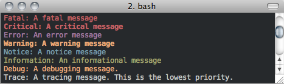

Logging 
--------

Mechanica has extensive logging system. Many internal methods will log extensive details (in full
color) to either the clog (typically stderr) or a user specified file path. Internally, the
Mechanica logging system is currently implemented by the Poco (http://pocoproject) logging system.

Future versions will include a Logging Listener, so that the Mechanica log will log messages
to a user specified function. 

The logging system is highly configurable, users have complete control over the color and format
of the logging messages. 

All methods of the Logger are static, they are available immediately upon loading the Mechanica
package. 

If one wants to display logging at the lowest level (LOG_TRACE), where every logging message is
displayed, one would run::

  m.Logging.setLevel(m.Logging.LOG_TRACE)

Logging the following messages::

  m.Logger.log(m.Logger.LOG_FATAL, "A fatal message")
  m.Logger.log(m.Logger.LOG_CRITICAL, "A critical message")
  m.Logger.log(m.Logger.LOG_ERROR, "An error message")
  m.Logger.log(m.Logger.LOG_WARNING, "A warning message")
  m.Logger.log(m.Logger.LOG_NOTICE, "A notice message")
  m.Logger.log(m.Logger.LOG_INFORMATION, "An informational message")
  m.Logger.log(m.Logger.LOG_DEBUG, "A debugging message.")
  m.Logger.log(m.Logger.LOG_TRACE,  "A tracing message. This is the lowest priority.")

will produce the following output:

If one wants different colors on the log, these can be set via::

  rr.Logger.setProperty("traceColor", "red")
  rr.Logger.setProperty("debugColor", "green")

The available color property names and values are listed below at the Logger.setProperty method.

Logging Levels
^^^^^^^^^^^^^^

The Logger has the following logging levels:

.. attribute:: Logger.LOG_CURRENT
   :module: mechanica

   Use the current level -- don't change the level from what it is.

.. attribute:: Logger.LOG_FATAL 
   :module: mechanica

   A fatal error. The application will most likely terminate. This is the highest priority.

.. attribute:: Logger.LOG_CRITICAL 
   :module: mechanica

   A critical error. The application might not be able to continue running successfully.

.. attribute:: Logger.LOG_ERROR 
   :module: mechanica

   An error. An operation did not complete successfully, but the application as a whole is not affected.

.. attribute:: Logger.LOG_WARNING 
   :module: mechanica

   A warning. An operation completed with an unexpected result.

.. attribute:: Logger.LOG_NOTICE 
   :module: mechanica

   A notice, which is an information with just a higher priority.

.. attribute:: Logger.LOG_INFORMATION 
   :module: mechanica

   An informational message, usually denoting the successful completion of an operation.

.. attribute:: Logger.LOG_DEBUG 
   :module: mechanica

   A debugging message.

.. attribute:: Logger.LOG_TRACE
   :module: mechanica

   A tracing message. This is the lowest priority.

Logging Methods
^^^^^^^^^^^^^^^

.. staticmethod:: Logger.setLevel([level])
   :module: mechanica

   sets the logging level to one a value from Logger::Level

   :param int level: the level to set, defaults to LOG_CURRENT if none is specified. 

.. staticmethod:: Logger.getLevel()
   :module: mechanica

   get the current logging level.

.. staticmethod:: Logger.disableLogging()
   :module: mechanica

   Suppresses all logging output

.. staticmethod:: Logger.disableConsoleLogging()
   :module: mechanica

   stops logging to the console, but file logging may continue.

.. staticmethod:: Logger.enableConsoleLogging(level)
   :module: mechanica

   turns on console logging (stderr) at the given level.

   :param level: A logging level, one of the above listed LOG_* levels.

.. staticmethod:: Logger.enableFileLogging(fileName, [level])
   :module: mechanica

   turns on file logging to the given file as the given level.

   :param str fileName: the path of a file to log to.
   :param level: (optional) the logging level, defaults to LOG_CURRENT. 

.. staticmethod:: Logger.disableFileLogging()
   :module: mechanica

   turns off file logging, but has no effect on console logging.

.. staticmethod:: Logger.getCurrentLevelAsString()
   :module: mechanica

   get the textural form of the current logging level.

.. staticmethod:: Logger.getFileName()
   :module: mechanica

   get the name of the currently used log file.

.. staticmethod:: Logger.setFormattingPattern(format)
   :module: mechanica

   Internally, Mechanica uses the Poco logging framework, so we
   can custom format logging output based on a formatting pattern
   string.
   
   The format pattern is used as a template to format the message and
   is copied character by character except for the following special characters,
   which are replaced by the corresponding value.
   
   An example pattern of "%Y-%m-%d %H:%M:%S %p: %t" set via::

     m.Logger.setFormattingPattern("%Y-%m-%d %H:%M:%S %p: %t")
      
   would produce the following output:

   .. image:: ./logging2.png
 
   |

   Mechanica supports the following format specifiers. These were copied from the Poco documentation:
   
   * %s - message source
   * %t - message text
   * %l - message priority level (1 .. 7)
   * %p - message priority (Fatal, Critical, Error, Warning, Notice, Information, Debug, Trace)
   * %q - abbreviated message priority (F, C, E, W, N, I, D, T)
   * %P - message process identifier
   * %T - message thread name
   * %I - message thread identifier (numeric)
   * %N - node or host name
   * %U - message source file path (empty string if not set)
   * %u - message source line number (0 if not set)
   * %w - message date/time abbreviated weekday (Mon, Tue, ...)
   * %W - message date/time full weekday (Monday, Tuesday, ...)
   * %b - message date/time abbreviated month (Jan, Feb, ...)
   * %B - message date/time full month (January, February, ...)
   * %d - message date/time zero-padded day of month (01 .. 31)
   * %e - message date/time day of month (1 .. 31)
   * %f - message date/time space-padded day of month ( 1 .. 31)
   * %m - message date/time zero-padded month (01 .. 12)
   * %n - message date/time month (1 .. 12)
   * %o - message date/time space-padded month ( 1 .. 12)
   * %y - message date/time year without century (70)
   * %Y - message date/time year with century (1970)
   * %H - message date/time hour (00 .. 23)
   * %h - message date/time hour (00 .. 12)
   * %a - message date/time am/pm
   * %A - message date/time AM/PM
   * %M - message date/time minute (00 .. 59)
   * %S - message date/time second (00 .. 59)
   * %i - message date/time millisecond (000 .. 999)
   * %c - message date/time centisecond (0 .. 9)
   * %F - message date/time fractional seconds/microseconds (000000 - 999999)
   * %z - time zone differential in ISO 8601 format (Z or +NN.NN)
   * %Z - time zone differential in RFC format (GMT or +NNNN)
   * %E - epoch time (UTC, seconds since midnight, January 1, 1970)
   * %[name] - the value of the message parameter with the given name
   * %% - percent sign

   :param str format: the logging format string. Must be formatted using the above specifiers. 

.. staticmethod:: Logger.getFormattingPattern()
   :module: mechanica

   get the currently set formatting pattern.

.. staticmethod:: Logger.levelToString(level)
   :module: mechanica

   gets the textual form of a logging level Enum for a given value.

   :param int level: One of the above listed logging levels. 

.. staticmethod:: Logger.stringToLevel(s)
   :module: mechanica

   parses a string and returns a Logger::Level

   :param str s: the string to parse. 

.. staticmethod:: Logger.getColoredOutput()
   :module: mechanica

   check if we have colored logging enabled.

.. staticmethod:: Logger.setColoredOutput(b)
   :module: mechanica

   enable / disable colored output

   :param boolean b: turn colored logging on or off

.. staticmethod:: Logger.setProperty(name, value)
   :module: mechanica

   Set the color of the output logging messages.
      
   In the future, we may add additional properties here.
   
   The following properties are supported:

   * enableColors:      Enable or disable colors.
   * traceColor:        Specify color for trace messages.
   * debugColor:        Specify color for debug messages.
   * informationColor:  Specify color for information messages.
   * noticeColor:       Specify color for notice messages.
   * warningColor:      Specify color for warning messages.
   * errorColor:        Specify color for error messages.
   * criticalColor:     Specify color for critical messages.
   * fatalColor:        Specify color for fatal messages.
            
            
   The following color values are supported:
   
   * default
   * black
   * red
   * green
   * brown
   * blue
   * magenta
   * cyan
   * gray
   * darkgray
   * lightRed
   * lightGreen
   * yellow
   * lightBlue
   * lightMagenta
   * lightCyan
   * white

   :param str name: the name of the value to set.
   :param str value: the value to set.

.. staticmethod:: Logger.log(level, msg)
   :module: mechanica

   logs a message to the log.

   :param int level: the level to log at.
   :param str msg: the message to log.
      
