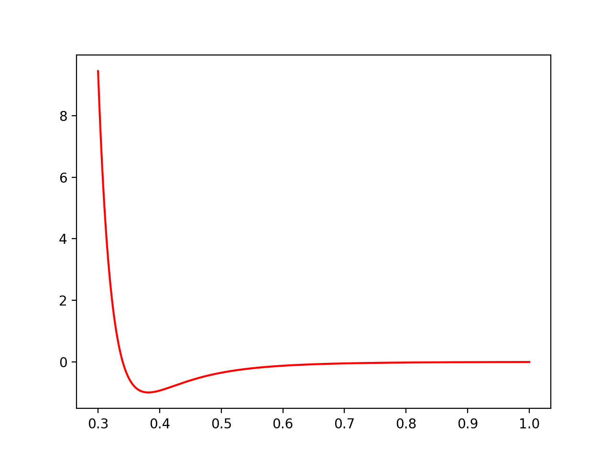

Potentials
----------

A Potential object is a compiled interpolation of a given function. The
Universe applies potentials to particles to calculate the net force on them.

For performance reasons, we found that implmenting potentials as
interpolations can be much faster than evaluating the function directly.

A potential can be treated just like any python callable object to evaluate it::

  >>> pot = m.Potential.lennard_jones_12_6(0.1, 5, 9.5075e-06 , 6.1545e-03, 1.0e-3 )
  >>> x = np.linspace(0.1,1,100)
  >>> y=[pot(j) for j in x]
  >>> plt.plot(x,y, 'r')

    Potential is a callable object, we can plot it like such::

.. class:: Potential

   
   .. staticmethod:: lennard_jones_12_6(min, max, a, b, )

      Creates a Potential representing a 12-6 Lennard-Jones potential
 
      :param min: The smallest radius for which the potential will be constructed.
      :param max: The largest radius for which the potential will be constructed.
      :param A:   The first parameter of the Lennard-Jones potential.
      :param B:   The second parameter of the Lennard-Jones potential.
      :param tol: The tolerance to which the interpolation should match the exact
             potential., optional
 
      The Lennard Jones potenntial has the form:

      .. math::
         \left( \frac{A}{r^{12}} - \frac{B}{r^6} \right)

   .. staticmethod:: lennard_jones_12_6_coulomb(min, max, a, b, tol )

      Creates a Potential representing the sum of a
       12-6 Lennard-Jones potential and a shifted Coulomb potential.
 
      :param min: The smallest radius for which the potential will be constructed.
      :param max: The largest radius for which the potential will be constructed.
      :param A: The first parameter of the Lennard-Jones potential.
      :param B: The second parameter of the Lennard-Jones potential.
      :param q: The charge scaling of the potential.
      :param tol: The tolerance to which the interpolation should match the exact
       potential. (optional)
 
      The 12-6 Lennard Jones - Coulomb potential has the form:

      .. math::
         \left( \frac{A}{r^{12}} - \frac{B}{r^6} \right)
         + q \left(\frac{1}{r} - \frac{1}{max} \right)

   .. staticmethod:: ewald(min, max, q, kappa, tol)

      Creates a potential representing the real-space part of an Ewald 
      potential.
 
      :param min: The smallest radius for which the potential will be constructed.
      :param max: The largest radius for which the potential will be constructed.
      :param q: The charge scaling of the potential.
      :param kappa: The screening distance of the Ewald potential.
      :param tol: The tolerance to which the interpolation should match the exact
                  potential.

      The Ewald potential has the form:

      .. math::
 
         q \frac{\mbox{erfc}( \kappa r)}{r} 
       
 
      
 

   .. staticmethod:: foo(more stuff)

