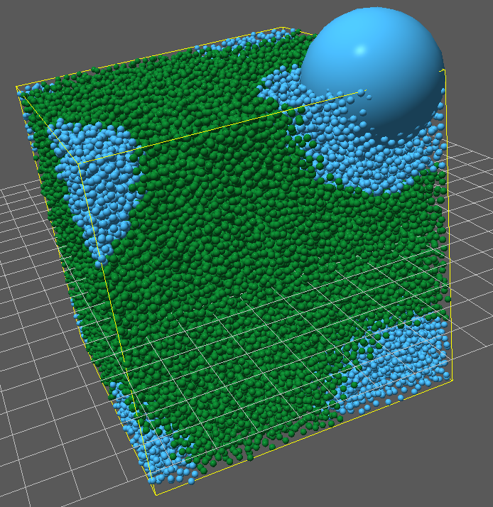

Changing Type
=============

One of the hallmarks of biological cells, and biological objects in general is
that they change *type* over time. For example a XXX cell change change type to
become a YYY cell. One way to think about what's going on here is that you have
a physical object of a certain kind, which has a certain set of physical
substances in it. Then their contents generally stays the same, but the set of
processes that act on the object change, the dynamics of the object changes,
although it's physical state may not be altered significantly.

In nature, An object's genotype is the set of genetic makeup of that object,
whereas an object's phenotype is the set of observable characteristics, which
are influenced both by its genotype it's environment.

In Mechanica, we use the concept of a Python language type analogously to a
phenotype. For a particular phenotype, we have an instance of an object, and the
type defines the set of interactions and processes that that object participates
in.

Type change is very common in nature, however is exceedingly rarely used in
compute languages. One example of a computer language with type change is
Smalltalk. Smalltalk has a method called **become**, which is one if it's most
powerful and unique features, and is also quite obscure outside of
the Smalltalk community,

Smalltalk's *become* method swaps the identities of a pair of object instances::

  a become: b

In Smalltalk, the the object `a` assumes the identity or *type* of `b`, and visa
versa. The contents of the of all object references to `a` and `b` get swapped,
so whenever any reference called `a`, it's now referring to the contents of
`b`. This is not simply swapping a pair of variables, like we would in python as
``(b,a) = (a,b)``, but rather *every* reference that pointed to the object `a`
now points to `b`. Thus in Smalltalk, both the *state* and *type* of the objects
change.

Mechanica's `become` is slightly different in that we only change the *type* of
the object, and generally leave the state of the object alone.

This of course comes with a caveat, in that say the variables defined in the
respective type definitions is different, such as if one type defined a
different set of :ref:`Species` than the the other. for example, if we have::

  class A(m.Particle):
     species = ['S1', 'S2', 'S3']

  class B(m.Particle):
     species = ['S2', 'S3', 'S4']

  a = A(); b = B();
  a.become(B)

We can see that types 'A' and 'B' only share species 'S2' and 'S2', but species
'S1' only exists in 'A' and 'S4' only exists in 'B'. In such cases, we keep the
values of the common state variables alone, destroy the species 'S1' (because it
does not exist in 'B', and create a new 'S4' and initialize it to it's default
value (if specified in an initial assignment). 

.. _type-change-fig:

    Changing the type of all the neighbors of an random object. We can do this
    with a single line of python, ``[p.become(B) for p in x.neighbors(3)]``

To create the model :numref:`(Fig. %s) <type-change-fig>`, we first create a
standard simulation, create a couple particle types, and define their size and
color::

  import mechanica as m
  import numpy as np

  m.Simulator()

  class A(m.Particle):
    radius=0.1
    dynamics = m.Overdamped
    mass=5
    style={"color":"MediumSeaGreen"}

  class B(m.Particle):
    radius=0.1
    dynamics = m.Overdamped
    mass=10
    style={"color":"skyblue"}

Make a potential, here we choose the :any:`coulomb` potential as we're using
periodic boundary conditions, and simply want the objects to uniformly push away
from each other, and uniformly fill space. We call the :any:`random_points`
function to create a set of random points that fills a cube ::

  p = m.Potential.coulomb(q=2, min=0.01, max=3)

  m.bind(p, A, A)
  m.bind(p, B, B)
  m.bind(p, A, B)

  r = m.forces.random(0, 1)

  m.bind(r, A)

  pos = m.random_points(m.SolidCube, 50000) * 10 + m.Universe.center

Create a new object of type `A` for every position in the list, and show the
simulator::

  [A(p) for p in pos]
  m.show()

Now, to choose the neighbors of an object, and change their type, we simply call
the :any:`neighbors` method on a randomly chosen particle. This returns a list
of objects near a, and we simply use the Python list syntax to call the
:meth:`Particle.become` method on every object in the neighbor list. Simply to make the
object more visible, we set it's radius to 2. Changing the radius of
particles that interact with a coulomb potential has no effect on the
force. ::

   a = A.items()[0]
   a.radius = 2    
   [p.become(B) for p in a.neighbors(3)]

You can download and run the complete model here:

Download: :download:`this example script <../../examples/change_type.py>`::

