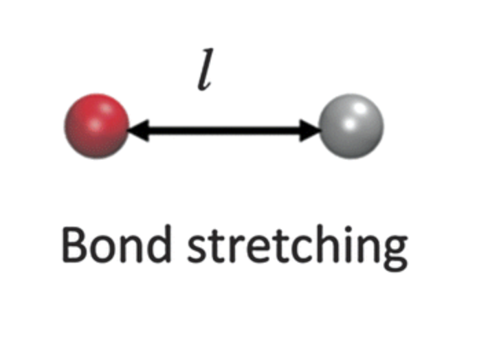
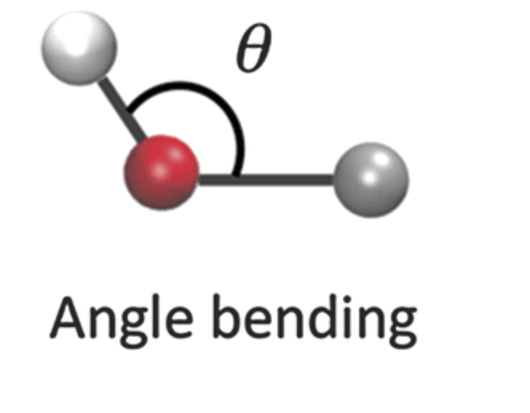

.. _bonded-interactions:

Bonded Interactions
===================

Bonded interactions are explicit bonds between particle instances.

We support the standard molecular dynamics bonds, angles, and torsions. 

Bonds
-----

bonds do stuff

some more text
akdjklasjdk
akjdalkjdsl
k

aDJalsdj

LKADJalj

.. rst-class::  clear-both

asdjfasdjfjkasdhdfj

fsfjhjk

Angles
------

Some text ... (will be displayed on the right of the image)

.. rst-class::  clear-both
