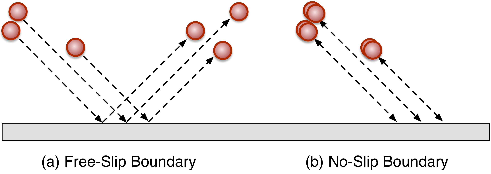

Boundary Conditions
===================

.. py:currentmodule:: mechanica

.. _boundary:

We can specify a variety of different boundary conditions via the `bc` argument
to the :any:`Simulator` constructor. We offer a range of boundary condition
options in the :ref:`Boundary Condition Constants` section.

We specify boundary conditions via the ``bc``  argument to the main
:func:`init` function call. Boundary conditions can be one of the simple kinds
if we use the numeric argument from the :ref:`Boundary Condition
Constants`, or can be a dictionary to use flexible boundary conditions.

For flexible boundary conditions, we pass a dictionary to the ``bc``
:func:`init` argument like::

   m.init(bc={'x':'periodic', 'z':'no_slip', 'y' : 'periodic'})

The top-level keys in the ``bc`` dictionary can be either ``"x"``, ``"y"``, ``"z"``, or
``"left"``, ``"right"``, ``"top"``, ``"bottom"``, ``"front"``, or ``"back"``. If
we choose one of the axis directions, ``"x"``, ``"y"``, ``"z"``, then
boundary condition is symmetric, i.e. if we set ``"x"`` to some value, then both
``"left"`` and ``"right"`` get set to that value. Valid options for axis
symmetric boundaries are ``"periodic"``, ``"freeslip"``, ``"noslip"`` or
``"potential"``.

Note, as a user convenience, we include some synonym, i.e. ``"no_slip"`` and
``"noslip"`` are equivlent, and ``"freeslip"`` and ``"free_slip"`` are
equivalent.

Periodic
--------
The periodic is one of the most widely used boundary condition types in
general. This effectively simulates an infinite domain where any agents that
leave one side automatically go back in the other. Also, any agents near a
boundary will interact with the agents of the opposite boundary, i.e. if there
is a repulsive interaction, the agent on the left boundary will be repulsed by
an agent on the right boundary. Periodic boundary conditions also determine how
chemical fluxes in the :ref:`flux-label` section operate. With periodic
boundaries will, flux will interact with agents on the opposing boundary, but
with non-periodic, fluxes will bounce back, or not see any agents on the opposing
boundary.

We can specify periodic boundary conditions using either the ``'periodic'``
dictionary argument, or via numeric constants from the :ref:`Boundary Condition
Constants` section, i.e. ::

  m.init(bc={'x':'periodic', 'y':'no_slip', 'z' : 'periodic'})

Freeslip and NoSlip
-------------------
Free-slip and no-slip boundary conditions reflect impacting particles back into
the simulation domain. Free-slip boundaries are essentially equivalent to a
boundary moving at the same tangential velocity *with* the simulation
objects. We can think it as each impacting agent collides with an equivlent
ghost agent with the same tangent velocity. No-slip boundaries are equivalent to
a stationary wall, in that impacting partricles bounce straight back, inverting
their velocity. We can specify these using the ``'freeslip'`` or ``'noslip'``
options to the boundary condition dictionary. 

Velocity
--------
No-slip boundary conditions are just a specialization of velocity boundaries
with zero velocity. Velocity boundaries model a simulation domain with a moving
wall boundary. We define a velocity boundary with a nested dictionary to the
individual boundary argument, i.e.::

  m.init(bc={'top':{'velocity':[-1, 0, 0]},
             'bottom':'noslip',
             'x':'noslip',
             'y':'noslip'})

  

Potential
---------

We can attach a potential to most boundary conditions, and we define a
potential only boundary condition using ``"potential"`` option, and then bind a
potential to the boundary just like we bind potentials between agent types::

  m.init(bc={'left':'potential', 'y':'no_slip', 'z' : 'periodic'})
  pot = m.Potential.coulomb(q=1, tol=0.0001, min=0.05)
  class MyAgent(m.Particle): pass
  m.bind(pot, MyAgent, m.universe.boundary_conditions.left)

In this example, we define the left boundary to be a potential type, then add a
coulomb potential between that boundary and our agent type, this any instance of
that agent will be repulsed by the boundary whenever it is near it. 

Potential boundary condtions default to ``'free_slip'``, but we can also create
other kinds of potentials, such as say a ``'velocity'`` and bind a potential to
that.

Reset
-----

The *reset* boundary condition is a special form of a periodic boundary
condition. The basic idea is we have two separate movment processes going on: we
have the physical parcels of space (agents) moving around, but they also carry
with them a chemical cargo. We have advection (movment of the physical parcels),
and diffusion (movment of chemical cargo between agents).

.. video:: _static/flux_periodic.mp4
   :width: 500
   :height: 300
   :autoplay:
   :nocontrols:

   

  

