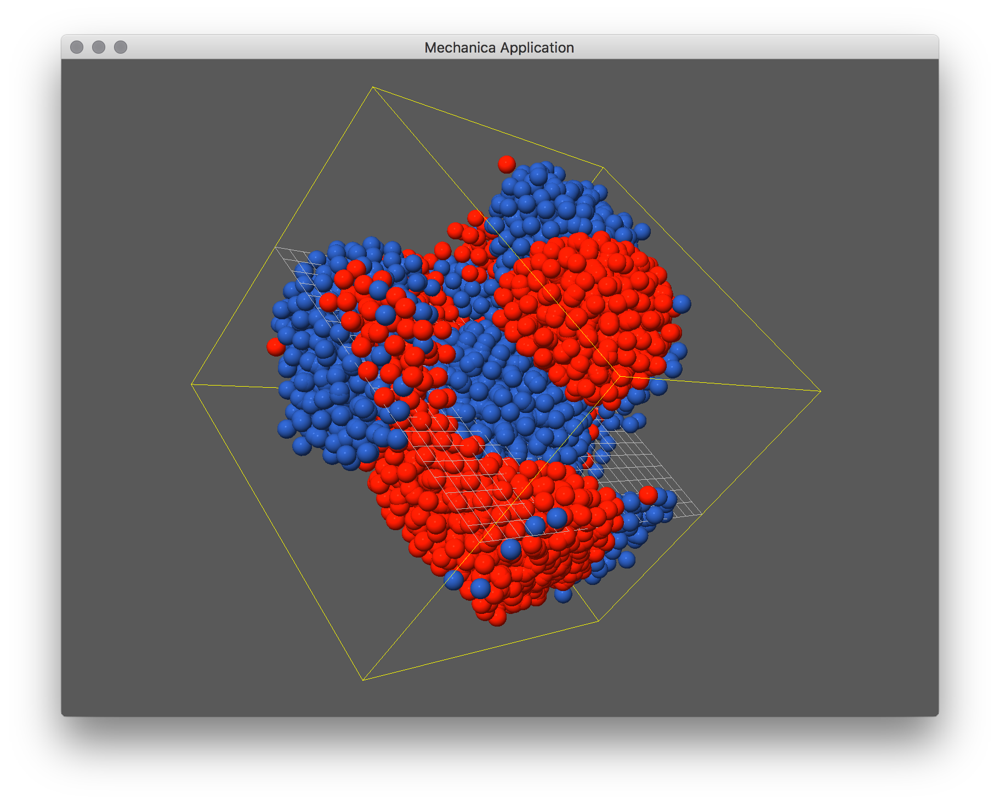
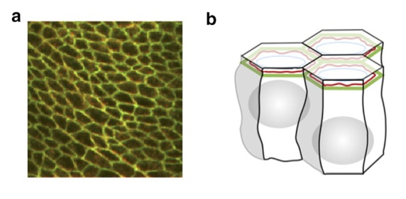

Cell Sorting
============

In this section, we use cell sorting as a motivating example to develop a
mechanica model. We first introduce the biological phenomena, then we start our
analysis by first identifying what are the key objects and processes in the
biological descrioption, and how we represent these physical concepts with
Mechanica objects and processes.

Cell sorting between biological cells of different types is one of the basic
mechanisms creating tissue domains during develoment and wound healing and in
maintaining domains in homeostasis.  Cells of two different types, when
dissociated and randomly mixed can spontaneously sort to reform ordered
tissues. Cell sorting can generate regular patterns such as checkerboards,
engulfment of one cell type by another, or other more complex patterns
:cite:`Steinberg:1970bq`.

    A combination of cells from 3-germ layers are dissociiated and re-organize, 
    each cell type sorts out into its own region :cite:`Townes:1955ft`.

Both complete and partial cell sorting (where clusters of one cell type are
trapped or contained inside a closed envelope of another cell type) have been
observed experimentally in vitro in embryonic cells. Cell sorting does not
involve cell division nor differentiation but only spatial rearrangement of cell
positions.

    A basic two-type simulation, about 25 lines of Python, as a simple extension
    of the two type example. 

In a classic in vitro cell
sorting experiment to determine relative cell adhesivities in embryonic tissues,
mesenchymal cells of different types are dissociated, then randomly mixed and
reaggregated. Their motility and differential adhesivities then lead them to
rearrange to reestablish coherent homogenous domains with the most cohesive cell
type surrounded by the less-cohesive cell types :cite:`Armstrong:1972ep`
:cite:`Armstrong:1984tc`.

Cell-sorting behavior of cell aggregates is similar to liquid surface tension,
in the spontaneous separation of immiscible liquids (water vs. oil). Adhesive
forces between mixed cells play a similar role in cell sorting that
intermolecular attractive (cohesive) forces play in liquid surface tension. In
cell sorting, the cells with the strongest highest adhesivities will be sorted
to the center, while the less cohesive ones will remain outside.

Modeling and Abstraction
------------------------

To develop a computational model of our biological system, we must first
identify the key objects and processes of our physical system. If we look at the
left side of the following figure, we can see a sheet of biogical cells. From
the previous description of the cell sorting, we also know that cells move
about. We know that epethelial sheets are essentially a sheet of cells that form
a surface. Here we can identify our first biogical object, a cell. From the
previous discussion, we know that there are more than one type of cell, so lets
call our two cell types, cell type A and cell type B.

.. _microscope-sheet-fig:

    On the left is a confocal microscope image of a developing Drosophila wing,
    where the outlines of the cells have been highlighte with a florescent protein,
    which binds to E-cadherin, a surface proteion involved in cell adhesion. We
    can represent this sheet of biological cells with a set of polygons constrained
    to a two dimensional surface. Taken from :cite:`Fletcher:2014hub`

Example Model
-------------

We start the example just like other Mechania models::

  import mechanica as m
  import numpy as np

  # total number of cells
  A_count = 5000
  B_count = 5000

  # potential cutoff distance
  cutoff = 3

  # dimensions of universe
  dim=np.array([20., 20., 20.])
  center = dim / 2

  # new simulator, don't load any example
  m.Simulator(example="", dim=dim, cutoff=cutoff)

We make two different cell types, `A` and `B`::

  class A(m.Particle):
    mass = 1
    radius = 0.5
    dynamics = m.Overdamped

  class B(m.Particle):
    mass = 1
    radius = 0.5
    dynamics = m.Overdamped

To represent the cell interactions, we create three different interacation
potentials, `pot_aa`, `pot_bb`, and `pot_ab`. These represent the strength of
interaction between cell types::

  # create three potentials, for each kind of particle interaction
  pot_aa = m.Potential.soft_sphere(kappa=400, epsilon=40, r0=1.5, \
                                 eta=2, tol = 0.05, min=0.01, max=3)

  pot_bb = m.Potential.soft_sphere(kappa=400, epsilon=40, r0=1.5, \
                                 eta=2, tol = 0.05, min=0.01, max=3)

  pot_ab = m.Potential.soft_sphere(kappa=400, epsilon=5, r0=1.5, \
                                 eta=2, tol = 0.05, min=0.01, max=3)

And bind those potentials to our cell types::

  # bind the potential with the *TYPES* of the particles
  m.Universe.bind(pot_aa, A, A)
  m.Universe.bind(pot_bb, B, B)
  m.Universe.bind(pot_ab, A, B)

We need a random force to keep the cells moving around, this represents
basically a cell motility::

  # create a random force. In overdamped dynamcis, we neeed a random force to
  # enable the objects to move around, otherwise they tend to get trapped
  # in a potential
  rforce = m.forces.random(0, 50)

  # bind it just like any other force
  m.bind(rforce, A)
  m.bind(rforce, B)

Create the particle instances::

  # create particle instances, for a total A_count + B_count cells
  for p in np.random.random((A_count,3)) * 15 + 2.5:
    A(p)

  for p in np.random.random((B_count,3)) * 15 + 2.5:
    B(p)

And finally run the simulation::

  # run the simulator
  m.Simulator.run()

The complete simulation script is here, and can be downloaded here:

Download: :download:`this example script <../../examples/cell_sorting.py>`::

