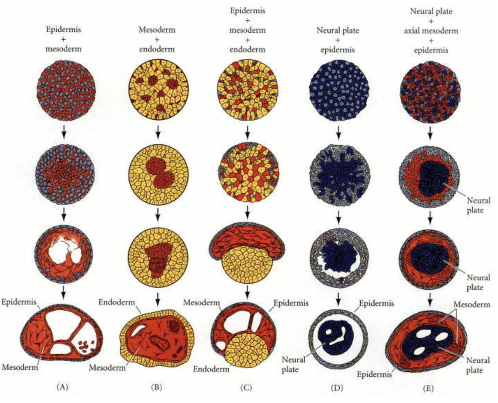

Cell Sorting
============

Cell sorting due to differential adhesion between cells of different types is
one of the basic mechanisms creating tissue domains during development and wound
healing and in maintaining domains in homeostasis. 
Cells of two different types, when dissociated and randomly mixed can spontaneously sort
to reform ordered  tissues. Cell sorting can generate regular patterns such as checkerboards, 
engulfment of one cell type by another, or other more complex patterns
:cite:`Steinberg:1970bq`.

    A combination of cells from 3-germ layers are dissociiated and re-organize,
    each cell type sorts out into its own region 

   

Both complete and partial cell sorting (where clusters of one cell type are trapped or contained inside a
closed envelope of another cell type) have been observed experimentally in vitro
in embryonic cells. Cell sorting does not involve cell
division nor differentiation but only spatial rearrangement of cell
positions. :cite:`Townes:1955ft`.

In a classic in vitro cell
sorting experiment to determine relative cell adhesivities in embryonic tissues,
mesenchymal cells of different types are dissociated, then randomly mixed and
reaggregated. Their motility and differential adhesivities then lead them to
rearrange to reestablish coherent homogenous domains with the most cohesive cell
type surrounded by the less-cohesive cell types :cite:`Armstrong:1972ep`
:cite:`Armstrong:1984tc`.

Cell-sorting behavior of cell aggregates is similar to liquid surface tension,
in the spontaneous separation of immiscible liquids (water vs. oil). Adhesive
forces between mixed cells play a similar role in cell sorting that
intermolecular attractive (cohesive) forces play in liquid surface tension. In
cell sorting, the cells with the strongest highest adhesivities will be sorted
to the center, while the less cohesive ones will remain outside.

.. bibliography:: papers.bib bibdesk.bib 
