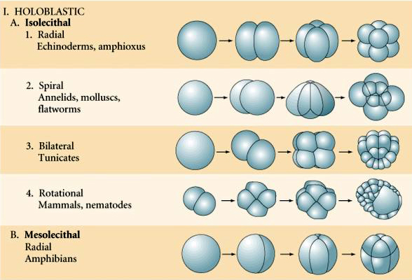
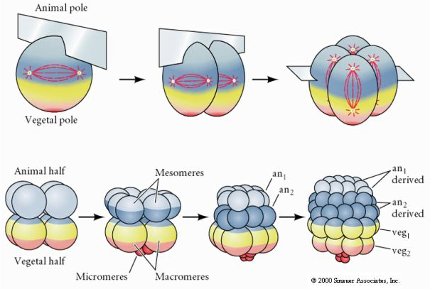

.. _cleavage-label:

Splitting and Cleavage
======================

With the Cluster concept previously introduced, we can do two very interesting
things with them: *Splitting* and *Cleavage*. We define a split, we start with a
cluster, and split it into two clusters, the original cluster, and a new
*daughter* cluster, and we proportion the contents of the original cluster
between itself, and the new dauger cluster. Cleavage on the other hand occurs
in-place in a cluster, and divides the contents of the cluster, and creates new
clusters contained within the orignal one.

The split operation is typically used to apply a cell division process, where
single cell splits into itself, and a new daughter. The cleavalge operation
models the early embryo cleavage processes. 

Splitting
---------

The `Cluster.split` method splits a given cluster into itself, and a new
daughter cluster. Split accepts optional `normal` and `point` arguments to define a
cleavage plane. If only a normal vector is given, and no point, the  `split`
uses the center of mass of the cluster as the point. For example, to split a
cluster along the `x` axis, we can::

  c = MyCell(...)
  d = c.split(normal=[1., 0., 0.])

where `d` is the new daughter cell. This form uses the center of mass of the
cluster as the cleavage plane point. We can also specify the full normal/point
form as::

  d = c.split(normal=[x, y, z], point=[px, py, pz])

If no named arguments are given, split interprets the first argument as a
cleavage plane normal::

  c.split([x, y, z])

We frequently want to split a cell along an *axis*, i.e. generate a cleavage
plane coincident with an axis. In this case, we use the optional `axis`
argument. Here, the split will generate a cleavage plane that contains the given
axis::

  c.split(axis=[x, y, z])

The default version of split uses a random cleavage plane that intersects the
cell center::

  d = c.split()

Split can also randomly pick half the particles in a cluster, and assign them to
a new cluster with the `random` agument as in::

  c.split(random=True)

Cleavage
--------

The `Cluster.cleave` method is the single entry point for all cleavage
operations, and it supports a lot of different options.

Cleavage is built on the concept of embryo cleavage. Embryology introduced some
rather interesting terminolgy that we adopt here. First off, embryologists have a
concept called an *animal* and *vegatble* poles. We represent these concepts
using the built-in base `Particle.orientation` vector, and here we use this
vector to represent a direction from the vegatable pole to the animal pole. All
of the forms of the `Cluster.cleave` method will use the cluster's `orientation`
vector in this way. So, setting a cluster's `orientation` vector, if the object
is used to represent an embryo sets the direction of the pole. All of the
contined cells can then refer to this property to get their orientation, i.e.::

  embryo = MyEmbryo(orientation=[1.0, 0.0, 0.0], ...)

creates an new embryo with it's pole aligned along the positive `x` axis.

The `Cluster.cleave` method is designed to perform the kinds of operations in: 

Radial Cleavage
^^^^^^^^^^^^^^^

We perform a radial cleavage using the `kind=RADIAL` argument, and a number that
specifies what level of cleavage to perform. As in the above figure, level 1
splits a single cluster into two, along the orientation axis, level 2 splits it
into 4 new clusters, orientated along the orietation axis, level 3 splits it
into 8 new clusters, usign a cleavage plane as in

For example, if we create an embryo, and call::

  embryo = MyEmbryo(orientation=[1.0, 0.0, 0.0], ...)
  embryo.cleave(kind=RADIAL, level=3, cell_type=MyEmbryo.Basic)

this creates eight new clsuters inside the parent embryo cluster, and assigns
all of them the `MyEmbryo.Basic` type. Or optionallly, we may use any Cluster
derived type. If the `cell_type` option is left blank, the new cluster default
to the top level `Cluster` type.

Subsequent Radial Cleavage
^^^^^^^^^^^^^^^^^^^^^^^^^^
We don't have to perform the cleavage in a single step, rather we can call::

  embryo.cleave(kind=RADIAL, cell_type=MyEmbryo.Basic)

without specifing a level, in this case, 'cleave` looks at the current number of
contained clusters, and perfoerms the next pre-defined cleavage operations. For
example, if the embryo only contained a single cell, then it pefrorms the first
cleavage operation. If there are two cells, it splits them along the orientation
axis, if there are 4, then it splits them perpendicular to the orientation axis,
as in the previous figure. 

    

