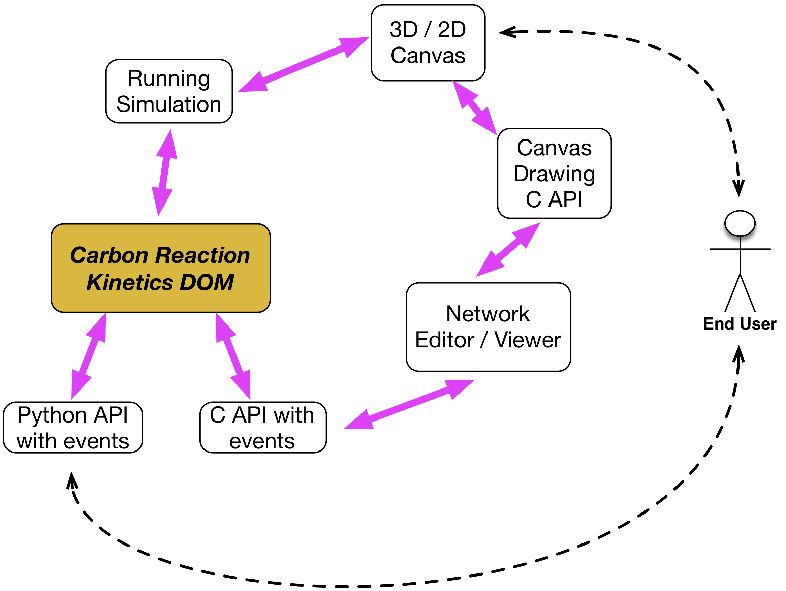

Continuum Reactions or Reaction Kinetics
----------------------------------------

The Carbon Reaction Kinetics (CRK) is a set of data structures (types) and APIs
for constructing, interacting, attachign to physical objects and visualizing
reaction kinetics models. 

* The CRK objects form a network and provide a way for users and developers to
  create and interact with RK models. 

* CRK objects are similar to, and generally have SBML analogs. 

* Internally implemnted as C++, have C and Python APIs.

* Represent both the API for creating networks, *and* for simulation and
  accessing values.

* Are a tree structure that the nework visulazion and visual editing tools
  operate on.

The libSBML API is only designed for manipulating the SBML DOM, for creating
and manipulating SBML documents. It does not have any way of accessing values
in a simulaiton.

Our objects here are a way for both creating and manipuating an RK network,
and also for accessing the values in a simulation.

.. _crk_fig:

    The Carbon reaction-kinetics DOM is the core of our model construction,
    simulation and visulazion workbench

Python Interaction
^^^^^^^^^^^^^^^^^^

The CRK provides a clean, concise and very native way for users to attach RK
networks to objects. Users can add 'species' and optionally, 'reactions'
definitions to a Python type, to automatically generate a rection kinetics
network on every instance of that type::

  # create one type of particle, species default to floating.  
  class A(m.Particle):
    species = ['S1', 'S2', 'S3']
    mass = 1
    
  # another type, with some reactions, and more complex species
  class B(m.Particle):
    species = {'S1' :Species(boundary=True, 1.0), 
               'Foo':5.0, 
               'Bar':10.0}
    reactions = ['S1 + S1 -> S3; k*S1*S2', 'S3->0; k2*S3']
    
  # create a flux between species at particles
  f = m.fluxes.fick(k=0.5, omega='gaussian')
  m.Universe.bind(f, A.S1, B.Foo)
  m.Universe.bind(f, A.S3, B.Foo)

The real power here with the CRK objects is that they also provide a way for
users to *directly* access and manipulate simulation values even whilst the
simulation is running. Adding a species (or reaction, or other CRK defintion) to
a Python class automatically generates accessor symbols on that python type so
that the actual value if the species is direclty availabe. For example, say a
user created a bunch of the aformention particles. Both of these defined a 'S1'
species, so a user could access these values directly as::

  for p in m.Universe.particles: 
    print(p.S1)

This works  because internally, CRK objects implement the Python *Descriptor
Object* protocal, and provide a way to add symbols to type definitions that
access the underlying *value* of that species or object name. This very
different from the libSBML API, which only provides a way to define a network
but has no concept of simulation or accessing values.

Network Visialization
^^^^^^^^^^^^^^^^^^^^^

The Network Visialization Component (NetViz) and Canvas shown in
:numref:`(Fig. %s) <crk_fig>` interacts with both the C API of the CRK ojbcts,
and the C API of the canvas component. Becaue the CRK C API supports events,
when end users click or interact with any object in the canvas, the coresponding
CRK object will emit an event. These events are things such as mouse over, mouse
enter, etc.. The NetViz componenent is essentially the glue between the network
of CRK objects and the tree of Canvas objects.

* Canvas API provides a series of methods to create visual, on-screen
  objects. Objects such as rectangles, text, shapes, etc..

* On-screen Canvas objects listen for user mouse events, key press events, etc
  and provide an API for attaching event listners to these evetns,

* The NetViz component has a reference to a set of CRK objects. It iterates over
  this collection, and generates a corresponding visual representation using the
  Canvas API.

* NetViz listens for user events from the visual Canvas objects. NetViz can then
  *signal* a corresponding event in a CRK object. This enables end-user Python
  code to recieve events from end-user mouse input. 
