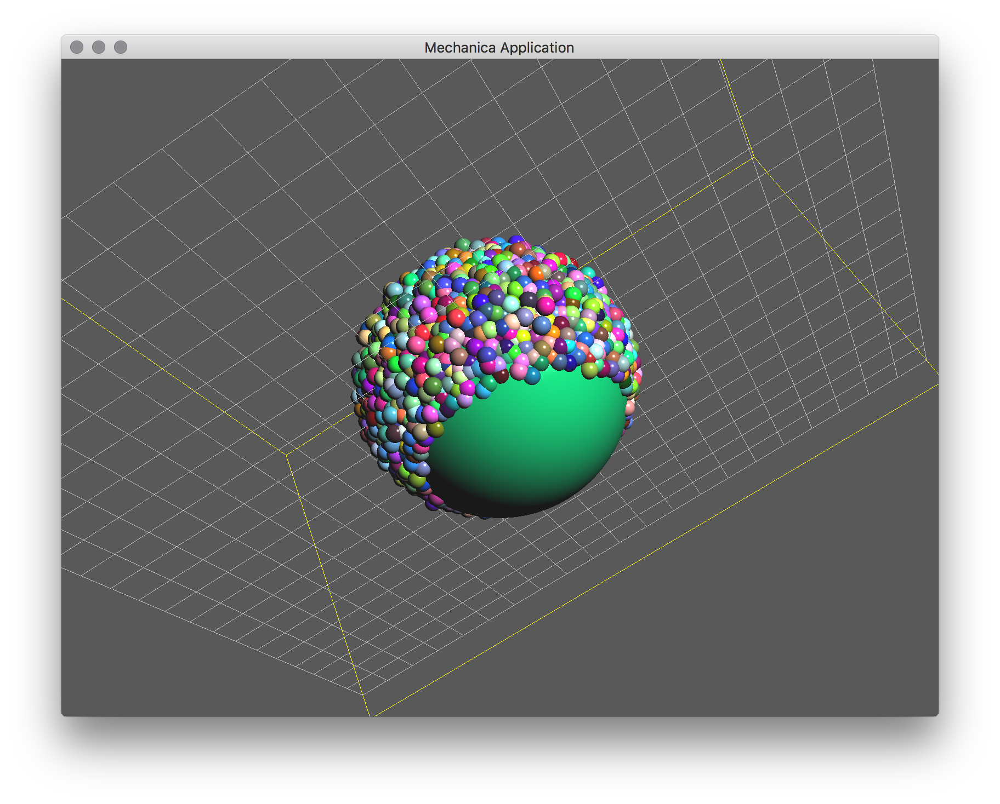

Epiboly
-------

Epiboly is one of the five major types of cell movement processes that occur in
early embryonic development in many organisms, such as sea urchins, tunicates,
amphibians. In epiboly, a layer of epithelial cells divides and spreads around a
yolk sac. The exact mechanicsm of epiboly are an active reasarch area, so an
interactive simulation enviorment such as Mechanica is an ideal testbed for
exploring different hypotheses.

We can create a very simple epiboly type model starting with our two type model,
the main change is use overdamped instead of Newtonian dynamics. Start with the
normal model::

  import mechanica as m
  import numpy as np

  # potential cutoff distance
  cutoff = 8

  # number of small cells
  count = 3000

  # dimensions of universe
  dim=np.array([20., 20., 20.])
  center = dim / 2

  # new simulator, don't load any example
  m.Simulator(example="", dim=dim, cutoff=cutoff)

Make big and small particles just like before, execept we now set the small
particle dynamics to `Overdamped`. We use a Big cell to represent a yolk sac,
and small particles to represent epithelial cells::

  class Big(m.Particle):
    mass = 500000
    radius = 3

  class Small(m.Particle):
    mass = 0.1
    radius = 0.2
    target_temperature=0
    dynamics = m.Overdamped

Create a couple interaction potentials that act between the agent types::

  pot_bs = m.Potential.soft_sphere(kappa=10, epsilon=50, r0=2.9, \
    eta=3, tol = 0.1, min=0.1, max=9)
  pot_ss = m.Potential.soft_sphere(kappa=20, epsilon=0.0001, r0=0.2, \
    eta=2, tol = 0.05, min=0.01, max=3)

  # bind the potential with the *TYPES* of the particles
  m.bind(pot_bs, Big, Small)
  m.bind(pot_ss, Small, Small)

  # create a random force. In overdamped dynamcis, we neeed a random force to
  # enable the objects to move around, otherwise they tend to get trapped
  # in a potential
  rforce = m.forces.random(0, 0.00000001)

  # bind it just like any other force
  m.bind(rforce, Small)

Make a single big particle (yolk sac) in the middle::

  Big(position=center, velocity=[0., 0., 0.])

Make a disk of particles above the big one::

  for p in m.random_point(m.Disk, count) * \
    1.5 * Big.radius + center + [0, 0, Big.radius + 1]:
    Small(p)

Run the simulation::

  m.Simulator.run()

    A basic epiboly simulation. The epithelial cells start in a disc above the
    yolk, and are attracted to the yolk. Since the epethialial cells both adhear
    to each other, and the yolk, and they are soft spheres, so the push other
    cells out of the way. Thus, they start as a blob, and relax to a sheet
    coverign the complete surface of the yolk sac.  

The complete simulation script is here, and can be downloaded here:

Download: :download:`this example script <../../examples/epiboly.py>`::
