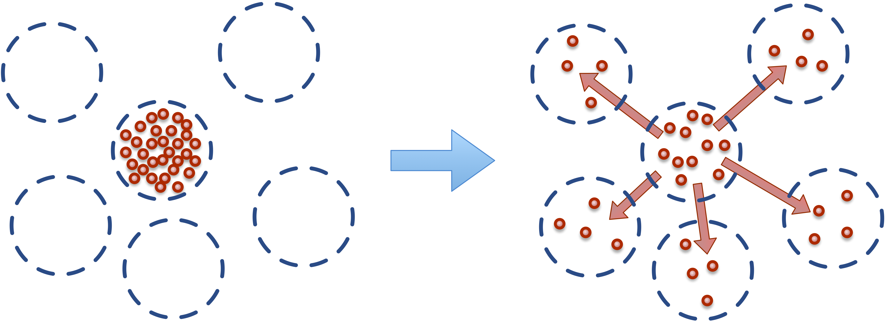

Chemical Reactions, Flux and Transport 
=======================================

.. py:module:: mechanica

Unlike a traditional micro-scale molecular dynamics approach, where each
computational particle represents an individual physical atom, a DPD is
mesoscopic approach, where each computational particle represents a 'parcel' of
a real fluid. A single DPD particle typically represents anywhere from a cubic
micron to a cubic mm, or about :math:`3.3 \times 10^{10}` to :math:`3.3 \times
10^{19}` water molecules.

Transport dissipative particle dynamics (tDPD) adds diffusing chemical solutes
to each classical DPD particle. Thus, each tDPD particle represents a parcel of
bulk fluid (solvent) with a set of chemical solutes at each particle. In tDPD,
the main particles represent the bulk medium, or the 'solvent', and these carry
along, or advect attached solutes. We introduce the term 'cargo' to refer to the
localized chemical solutes at each particle.

In general, the time evolution of the chemical species at each spatial object 
is given as:

.. math::

   \frac{dS_i}{dt} = Q_i = \sum_{i \neq j} Q^T_{ij} +Q^R_i,

where the rate of change of the vector of chemical species at an object is equal
to the flux vector, :math:`Q_i`. This is the sum of the transport and reactive
fluxes. :math:`Q^T`, is the *transport flux*, and :math:`Q^R_i` is a local
reactive flux, in the form of a local reaction network. We will cover local
reaction fluxes in later paper, for now we restrict this discussion to the
*passive* or 'Fickian' flux, *secretion* flux and *uptake* flux.

Before we cover spatial transport, we first cover adding chemical reaction
networks to objects. 

To attach chemical cargo to a particle, we simply add a ``species`` specifier to
the particle type definition as::

  class A(m.Particle):
    species = ['S1', 'S2', S3']

This defines the three chemical species, `S1`, `S2`, and `S3` in the *type*
definition. Thus, when we create an *instance* of the object, that instance will
have a vector of chemical species attached to it, and is accessible via the
:any:`Particle.species` attribute. Internally, we allocate a memory block for
each object instance, and users can attach a set of reactions to define the time
evolution of these attached chemical species.

If we access this species list from the *type*, we get::

  >>> print(A.species)
  SpeciesList(['S1', 'S2', 'S3'])

This is a special list of SBML species definitions. It's important to note that
once we've defined the list of species in each time, that list is
immutable. Creating a list of species with just their names is the simplest
example, if we need more control, we can create a list from more complex species
definition strings in :ref:`Species`.

If a *type* is defined with a `species` definition, every *instance* of that
type will get a *StateVector*, of these substances. Internally, a state vector
is really just a contiguous block of numbers, and we can attach a reaction
network or rate rules to define their time evolution. 

Each *instance* of a type with a `species` identifier gets a `species`
attribute, and we can access the values here. In the instance, the `species`
attribute acts a bit like an array, in that we can get it's length, and use
numeric indices to read values::

  >>> a = A()
  >>> print(a.species)
  StateVector([S1:0, S2:0, S3:0])

As we can see, the state vector is array like, but in addition to the numerical
values of the species, it contains a lot of meta-data of the species
definitions. We can access individual values using array indexing as::

  >>> print(a.species[0])
  0.0

  >>> a.species[0] = 1
  >>> print(a.species[0])
  1.0

The state vector also automatically gets accessors for each of the species
names, and we can access them just like standard Python attributes::

  >>> print(a.species.S1)
  1.0

  >>> a.species.S1 = 5
  >>> print(a.species.S1)
  5.0

We can even get all of the original species attributes directly from the
instance state vector like::

  >>> print(a.species[1].id)
  'S2'
  >>> print(a.species.S2.id)
  'S2'

In most cases, when we access the species values, we are accessing the
*concentration* value. See the SBML documentation, but the basic idea is that we
internally work with amounts, but each of these species exists in a physical
region of space (remember, a particle defines a region of space), so the value
we return in the amount divided by the volume of the object that the species is
in. Sometimes we want to work with amounts, or we explicitly want to work with
concentrations. As such, we can access these with the `amount` or `conc`
attributes on the state vector objects as such::

  >>> print(a.species.amount)
  1.0

  >>> print(a.species.conc)
  0.5

.. _species-label:

Species
-------
This simple version of the `species` definition defaults to create a set of
*floating* species, or species who's value varies in time, and they participate
in reaction and flux processes. We also allow other kinds species such as
*boundary*, or have initial values. 

The Mechanica :any:`Species` object is *essentially* a Python binding around the
libSBML Species class, but provides some Pythonic conveniences. For example, in
our binding, we use convential Python `snake_case` sytax, and all of the sbml
properties are avialable via simple properties on the objects. Many SBML
concepts such as `initial_amount`, `constant`, etc. are optional values that may
or may not be set. In the standard libSBML binding, users need to use a variety
of `isBoundaryConditionSet()`, `unsetBoundaryCondition()`, etc... methods that
are a direct python binding to the native C++ API. As a convience to our
users, our methods simply return a Python `None` if the field is not set,
otherwise returns the value, i.e. to get an initial amount::

  >>> print(a.initial_amount)
  None
  >>> a.initial_amount = 5.0

This internally updates the libSBML `Species` object that we use. As such, if
the user wants to save this sbml, all of these values are set accordingly. 

The simplest species object simply takes the name of the species as the only
argument::

  >>> s = Species("S1")

We can make a `boundary` species, that is, one that acts like a boundary
condition with a "$" in the argument as::

  >>> bs = Species("$S1")
  >>> print(bs.id)
  'S1'
  >>> print(bs.boundary)
  True

The Species constructor also supports initial values, we specify these by adding
a "= value" right hand side expression to the species string::

  >>> ia = Species("S1 = 1.2345")
  >>> print(ia.id)
  'S1'
  >>> print(ia.initial_amount)
  1.2345

Spatial Transport and Flux
--------------------------

Recall that the bulk or solvent particles don't represent a single molecule,
but rather a parcel of fluid. As such, dissolved chemical solutes (cargo) in each
parcel of fluid have natural tendency to *diffuse* to nearby locations.

    Dissolved solutes have a natural tendency to diffuse to nearby locations. 

This micro-scale diffusion of solutes results in mixing or mass transport
without directed bulk motion of the solvent. We refer to the bulk motion, or
bulk flow of the solvent as *advection*, and use *convection* to describe the
combination of both transport phenomena. Diffusion processes are typically
either *normal* or *anomalous*. Normal (Fickian) diffusion obeys Fick's laws,
and anomalous (non-Fickian) does not.

We introduce the concept of *flux* to describe this transport of material
(chemical solutes) between particles. Fluxes are similar
similar to conventional pair-wise forces between particles, in that a flux is
between all particles that match a specific type and are within a certain
distance from each other. The only differences between a flux and a force, is
that a flux is between the chemical cargo on particles, and modifies
(transports) chemical cargo between particles, whereas a force modifies the net
force acting on each particle.

We attach a flux between chemical cargo as::

  class A(m.Particle)
     species = ['S1', 'S2', 'S3']

  class B(m.Particle)
     species = ['S1, 'Foo', 'Bar']

  q = m.fluxes.fickian(k = 0.5)

  m.Universe.bind(q, A.S1, B.S)
  m.Universe.bind(q, A.S2, B.Bar)

This creates a Fickian diffusive flux object ``q``, and binds it between species
on two different particle types. Thus, whenever any pair of particles instances
belonging to these types are near each other, the runtime will apply a Fickian
diffusive flux between the species attached to these two particle instances.

.. _flux-label:

Diffusion and Passive Flux
--------------------------

We implement a diffusion process of chemical species located at object instances
using the basic passive (Fickian) flux type, with the :py:func:`flux`. This flux
implements a passive  transport between a species located on a pair of nearby objects of type a
and b. A Fick flux of the species :math:`S` attached to object types
:math:`A` and :math:`B` implements the reaction:

.. math::

   \begin{eqnarray}
   a.S & \leftrightarrow a.S \; &; \; k \left(1 - \frac{r}{r_{cutoff}} \right)\left(a.S - b.S\right)     \\
   a.S & \rightarrow 0   \; &; \; \frac{d}{2} a.S \\
   b.S & \rightarrow 0   \; &; \; \frac{d}{2} b.S,
   \end{eqnarray}

:math:`B` respectivly. :math:`S` is a chemical species located at each
object instances. :math:`k` is the flux constant, :math:`r` is the
distance between the two objects, :math:`r_{cutoff}` is the global cutoff
distance, and :math:`d` is the optional decay term.

For active pumping, to implement such processes like membrane ion pumps, or
other forms of active transport, we provide the :func:`secrete_flux` and
:func:`uptake_flux` objects.

The secrete flux implements the reaction:

.. math::

   \begin{eqnarray}
   a.S & \rightarrow b.S \; &; \;  k \left(r - \frac{r}{r_{cutoff}} \right)\left(a.S - a.S_{target} \right) \\
   a.S & \rightarrow 0   \; &; \;  \frac{d}{2} a.S \\
   b.S & \rightarrow 0   \; &; \;  \frac{d}{2} b.S
   \end{eqnarray}

The uptake flux implements the reaction:

.. math::

   \begin{eqnarray}
   a.S & \rightarrow b.S \; &; \; k \left(1 - \frac{r}{r_{cutoff}} \right)\left(1 - \frac{b.S}{b.S_{target}} \right)\left(a.S\right) \\
   a.S & \rightarrow 0   \; &; \; \frac{d}{2} a.S \\
   b.S & \rightarrow 0   \; &; \; \frac{d}{2} b.S
   \end{eqnarray}

   

Here, the :math:`\left(1 - \frac{b.S}{b.S_{target}} \right)` influences the
forward rate, where :math:`[b.S]` is the concentration of the substance S, and
:math:`b.S_{target}` is the target concentration. The flux will continue forward
so long as there is both concentration of the reactant, :math:`a.S`, and
the product :math:`b.S` remains below its target value. Notice that if the
present concentation of :math:`b.S` is *above* its target, the reaction will
proceed in the reverse direction. Thus, the :func:`pumping_flux` can be used to
implement both secretion and uptake reactions. 

