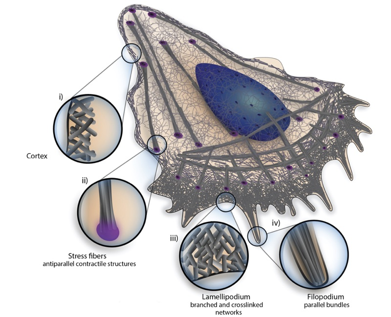
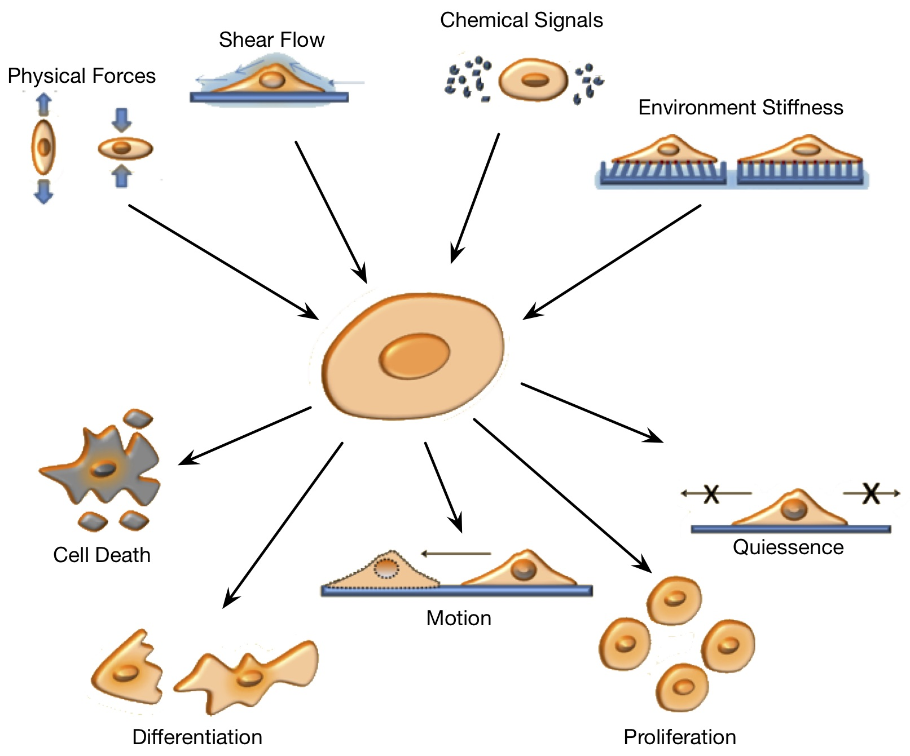
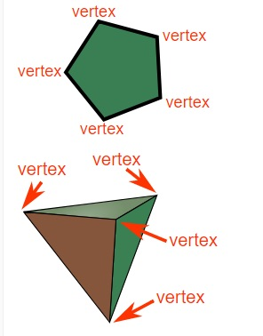

Formalizing Physical Knowledge
******************************

The first step in formalizing knowledge is writing it down in such a way that it
has semantic meaning for both humans and computers. In order to specify
biological phenomena, we need a modeling description that corresponding closely
to natural phenomena.

Let's start by looking at the folliwing diagram of a single biological
cell. This cell could be moving on a surface, or inside some tissue. 

.. _cell_1:

    A biological cell is a complex dynamic entity that participates in many
    active processes.

We can imedietly idenfity a number of *things*. Things such as cell nuclie, cell
membrane, cytoplasm, actin fibers, lamellpoidium, filopodium, etc.. We call
these things **objects**. Objects represent the “things” such as molecules, proteins,
cells, fluids, or materials. An object is defined as any instantiable physical
or logical entity that has certain state-full or structural
properties.

We also understand that for any living or active things, these objects typically
not static. Cells can move around, active fibers contract, cells can excert
forces on it's neighboring cells and enviormnet, cells can sense and respond
with chemical signaling, and so forth as in the following figure

    Biological cells can sense a variaety of signals in their envionrment and
    respond with a variety of behaviors. 

We call anything that *causes* something to change a **process**. Processes
represent anything that causes a change in state. A process may, for example,
represent a transformation in which sub-strates are consumed and products are
produced, or it may alter the state of an object, either continuously or
discretely. Unlike traditional programming languages, processes in Mechanica can
operate concurrently and continuously.

Mechanica represents physical concepts using two key concepts: **objects** and
**processes**. This paradigm
of representing the world in terms of objects and processes forms the basis of
the Cellular Behavior Ontology (CBO) :cite:`Sluka:2014wz`, and also the Object
Process Methodology (OPM) :cite:`Dori:0pbBYLeH`.

Objects
=======

   	
**Objects** are the nouns, the actual things being described. Objects are such
things as molecules, cells, membranes, ion channels, the extra-cellular matrix,
fluids, etc. Objects have quantifiable characteristics such as location, amount,
concentration, mass and volume. Objects define a state; they are comparable to
standard data structures in conventional programming languages. Objects may
inherit and extend other objects, or may contain other objects. Objects are
grouped into two categories: continuous and discrete. Continous objects describe
things such as continuously valued chemical or molecular fields which have
position-dependent concentrations. Chemical fields may be 3D in that they are
bounded by a surface or 2D in that they exist on a surface. For reasons of
numerical efficiency, users may specify fields as spatially uniform.

Processes
=========
**Processes** are the verbs. Processes may create and destroy objects, alter the
state of objects, transform objects, or consume and produce sets of objects. As
in nature, multiple Mechannica processes act concurrently on objects and may act at
different rates, but may only be active under certain circumstances. Processes
may be continuously active, or may be explicitly triggered  by specific
conditions or invoked directly by some other process. Processes may also be
combined or aggregated, such that a process may be hierarchically composed of
child processes, and child processes may be ordered either concurrently or
sequentially. Processes fall into two categories: continuous and discrete.

Types
=====
Every *thing* that we have previosly discussed, objects and process has a
well-defined **type**. Types are a basic concept common to most programming
languages, serving to classify variable instances into categories. The type of a
variable determines the kind of data which may be stored in that
variable. Essentially, a type in programming languages is roughly analogous to
genotype in biology. The type of an object defines what operations are valid on
that instance, i.e. we can sum two numeric types, but adding a numeric type to,
say, a string is ill defined. Most programming languages do not have a concept
related to the biological notion of a phenotype. A phenotype in biology is a
metric, an observable categorization that determines the cell type of a
particular cell instance. A phenotype is defined by a set of rules, or
conditions; when these conditions are met, we say that a cell is of such type.

The CCOPM extends the basic concept of dynamic or static types with a rule-based
type. Here, the a type may be defined via a set of rules, and when all of these
rules are met, we say that a variable instance is a certain type. This notion is
important because biological cells frequently undergo phenotypic change, that
is, they change type over time. Again, processes are defined to operate on a
specific type. Here we can create a type definition based on a set of
conditions; when all of these conditions are met, the type expression becomes
true, and the processes corresponding to that type definition now automatically
become active on all object instances for which the type evaluates to true.

The type of an object in a programming language must be unambiguous, since the
type assigns meaning to a block of memory. A type formally defines the layout of
a memory block and the types of data it stores. Strongly-typed programming
languages require that we associate a type to each object or process when we
define its identifier (symbol). Weakly-typed programming languages determine
object and process types according to a set of rules and do not require that we
declare the type of the object when we create it. In some weakly-typed
languages, an object can even change type. A type system is a collection of
rules that define the set of object types which can participate in a given
process.

Most programming languages lack a concept corresponding to phenotype. A
programming language cannot, in general, look at a memory block and determine
the type of object it contains by analyzing its contents. A phenotype, on the
other hand, is a list of conditions that determine how to categorize an object
from the object’s properties. However both programming languages and biology
have type systems. Indeed, biological modeling is the creation of a type system
for a specific situation –collecting and defining a set of rules which specify
which types of objects participate in which types of processes.

CCOPM extends the programming language concept of type with a rule-based
definition of type. The type definition needs to be fuzzy so that we can ask how
much an object instance participates in a type. Current programming languages
support only Boolean type inquiries, in the CCOPM inquiring if an object is of a
specified type returns a real value between 0 and 1.

\textbf{Types} serve to classify variable instances into categories. The type of
a variable determines the kind of data that may be stored in that variable. The
type of an object defines what operations are valid on instances of that object
type, i.e., we can sum two numeric types, but adding a numeric type to a string
is ill-defined. Most programming languages do not have a concept related to the
biological notion of a phenotype. A phenotype in biology is a \emph{metric}, an
observable categorization that determines a cell's type. A phenotype is defined
by a set of rules or conditions such that when these conditions are met, we say
that a cell is of such type.

The CCOPM extends the basic concept of dynamic or static types with a rule-based
type, which is related to the concept of typestate oriented programming
:cite:`Strom:1986ht`. Here, the type may be defined via a set of rules, and when
all of those rules are met, we say that a variable instance is a certain
type. This notion is important because biological cells frequently undergo
phenotypic change, that is, they change type over time. Processes are
defined to operate on a specific type, and the runtime automatically
applies these processes to all instances of the specified type. Here we
can create a type definition based on a set of conditions; when all of
these conditions are met, the type expression becomes true, and the
processes corresponding to that type definition now automatically become
active on all object instances for which the type evaluates to true.

Mechanisms
==========

Now that we have established a vocabulary and a formalism, lets again look at
:numref:`cell_1`, and start formalizing what kinds of objects make up the cell,
and developing *models* or abstractions to represent these concepts.

.. |vertex1| image:: vertex_1.jpg   
   :width: 120%
   :align: middle

.. table:: This is my table
   :widths:  30 20 

   +-----------+-----------+
   | |vertex1| | |vertex2| |
   +-----------+-----------+

Forces
======

Forces are kind of process that applies a force to a physical object. 

Force processes ($\phi$-processes) provide a way to describe spatial change, such as motion, deformation, adhesion or response to  external forces. $\phi$-processes are similar to force functions in molecular dynamics. A $\phi$-process can be defined to act on one or between two spatial objects, hence a $\phi$-process may have one or two arguments, and both of them must be spatial object subtypes. $\phi$-processes return the force that acts on its arguments. Any motion processes (adhesion, taxis, deformation) can be specified via a suitable force process. For example, when an adhesion process is active between a surfaces of a pair of cells, the adhesion process applies a force between the cell surfaces at the locations where the surfaces are in contact. This adhesive force acts to keep the cells in contact and resists surface separation. 

The language runtime automatically applies the force functions to spatial objects and calculates the net force acting on each spatial object. The runtime then calculates the time evolution of each spatial object, typically as $\mathbf{v} \propto \mathbf{F}/m$, where velocity is proportional to the net force acting on each spatial object. 

