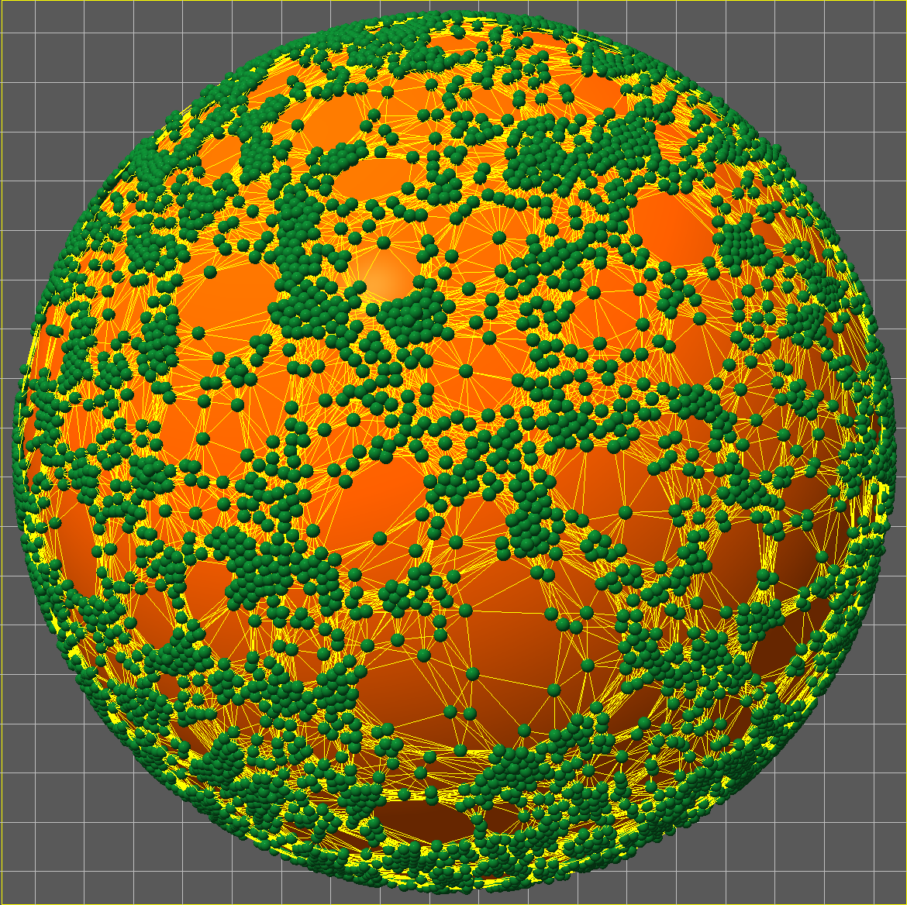

.. Mechanica documentation master file, created by
   sphinx-quickstart on Tue Oct 16 13:21:40 2018.
   You can adapt this file completely to your liking, but it should at least
   contain the root `toctree` directive.

***********************************************************************
Mechanica real-time interactive biological and active-matter simulation
***********************************************************************

Contents:

.. toctree::
   :maxdepth: 4

   introduction
   getting
   quick_start
   examples
   concepts
   clusters
   cleavage
   potentials
   metrics
   become
   style
   flux
   secrete_uptake
   bonded_interactions
   continuum-reactions
   network-object-model
   formalism
   api_reference
   building
   status
   references
   acknowledgements

Indices and tables
##################

* :ref:`genindex`
* :ref:`modindex`
* :ref:`search`

