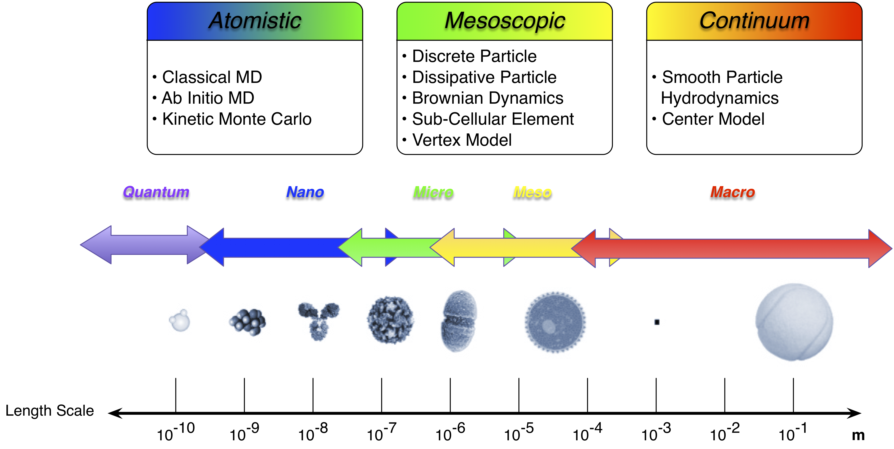
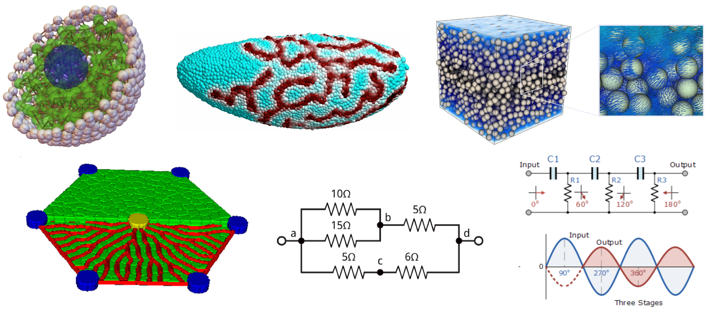

Introduction
************

Mechanica is an interactive particle based physics, chemistry and biology
simulation environment, with a heavy emphasis towards enabling users to model
and simulate complex sub-cellular and cellular biological physics
problems. Mechanica is part of the Tellurium
`<http://tellurium.analogmachine.org>`_ project.

Mechanica is designed first and foremost to enable users to work interactively
with simulations -- so they can build, and run a simulation in real-time, and
interact with that simulation whilst it's running. The goal is to create an
SolidWorks type environment where users can create and explore virtual models of
soft condensed matter physics, with a emphasis towards biological physics.

Mechanica is a native compiled C++ shared library with a native and extensive
Python API, that's designed to used from an ipython console (or via scripts of
course). 

.. raw:: html

   <iframe
         width="560" height="315"
         src="https://www.youtube.com/embed/jQzAkMAyVBo"
         frameborder="0" allow="accelerometer; autoplay;
         encrypted-media; gyroscope; picture-in-picture"
         allowfullscreen>
   </iframe>

Biological cells and biochemical molecules and particles are the prototypical
example of active matter. These are all actively driven agents that transduct
free energy from their environment. These agents can sense and respond to
mechanical, chemical and electrical environmental stimuli with a range of
behaviors, including dynamic changes in morphology and mechanical properties,
chemical uptake and secretion, cell differentiation, proliferation, death, and
migration.

One of the greatest challenges at these medium length scales is that these
dynamics and behaviors typically cannot be derived from first
principles. Rather, the observed behaviors are described phenomenologically or
empirically. Thus, the scientist exploring these kinds of phenomena needs a
great deal of flexibility to propose and experiment with different kinds of
interactions.

This presents a significant challenge, as simulation environments that make it
simple for the end user to write models without resorting to hard-coding C++ or
FORTRAN usually are very limited in the level of flexibility they provide the
end user. For example, if users want to write a standard molecular dynamics
model, there are many different, really good choices of simulation engines and
these kinds of models can easily be specified by human readable configuration
files. However, as the kinds of interactions are not well standardized or
formalized at medium length scales, users almost always are forced to resort to
hard-coding FORTRAN or C++.

    Particle Dynamics enables modeling a wide range of length scales

Our goal here is to deliver a modeling and simulation framework that lets users
INTERACTIVELY create, simulate and explore models at biologically relevant length
scales. We believe that interactive simulation is key to increasing scientific
productivity, much like interactive modeling environments such as SolidWorks has
revolutionized engineering practice.

We thus present Mechanica, an interactive modeling and simulation environment
based on off-lattice formalism that lets users create models for a wide range of
biologically relevant problems, and we enable users to write models using any
combination of the following modeling methodologies: 

* Coarse Grained Molecular Dynamics
* Discrete Element Method (DEM). DEM particles add rotational degrees-of-freedom
  as well as stateful contact and often complicated geometries (including
  polyhedra).
* Dissipative Particle Dynamics (DPD) is a particle-based method, where particles
  represent whole molecules or fluid regions rather than single atoms, and
  atomistic details are not considered relevant to the processes addressed. The
  particles' internal degrees of freedom are averaged out and represented by
  simplified pairwise dissipative and random forces, so as to conserve momentum
  locally and ensure correct hydrodynamic behavior. DPD allows much longer time
  and length scales than are possible using conventional MD simulations.
* Sub-Cellular Element (SCM). Frequently used to model complex sub-cellular
  active mechanics. SCM are similar to DPD, where each particle represents a
  region of space and is governed by empirically derived potentials, but adds
  active response.
* Smoothed particle hydrodynamics (SPH)is a  particle method very similar to DPD and
  is frequently used to model complex fluid flows, especially large fluid
  deformations, fluid-solid interactions, and multi-scale physics.
* Reactive Molecular Dynamics. In RMD, particles react with other particles and
  form new molecules, and can absorb or emit energy into their environment.
  Mechanica is designed to support reactive particles, as one of our main goals is
  very efficient particle creation and deletion. Very few classical molecular
  dynamics packages support reactive MD, as they are almost all highly optimized
  towards conserved number of particles.
* Perhaps most uniquely, Mechanica allows users to attach a chemical cargo to
  each particle, and host a chemical reaction network at each
  element. Furthermore, we allow users to write *fluxes* between particles. A
  flux defines a movement of material from one site to another. Furthermore, we
  also allow users to attach their own handlers to a variety of different
  *events* that particles (or other objects) can emit. Therefore, we also
  support developing full *Transport Dissipative Particle Dynamics* simulations.
* Flux Networks. The concept of a flux is extremly general, and this lets us
  define a *connector* type that lets users connect different model
  elements. Flux networks allow us to define a wide range of problems,
  from biological fluid flow in areas like the liver and the eye, to
  physiologically based pharmacokinetic (PBPK) modeling, and  even to electric
  circuits and pipe flow networks. 

.. warning:: Only a subset of these features are presently available, and we encourage users
  to look at the :ref:`status` page, and **PLEASE LET US KNOW WHAT FEATURES YOU
  WANT**. We can only deliver the kind of software users want if you let us know
  what features you want to see. Please contact us at `<somogyie@indiana.edu>` or
  on Twitter at `@AndySomogyi`

Once we have a well-defined, and user tested API for generalized particle
dynamics, we will integrate our existing *Vertex Model* code into
Mechanica. Vertex Model is another specialized form of classical Molecular
Dynamics, but with instead of the traditional bonded relationships of bonds,
angles, dihedrals, impropers, Vertex Models add some new kinds of bonded
relationships such as polygons and volumes to represent surface and volume
forces. 

    The kinds of problems Mechanica is designed to enable users to model. 

   

