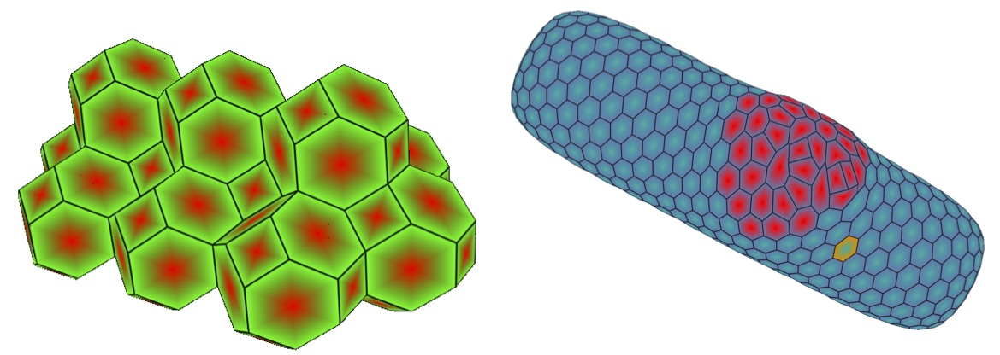

Introduction
************

Mechanica is an interative particle based physics and chemistry simulation
envioronment, with a heavy emphasis towards enableing users to model and
simulate complex sub-cellular and cellular biological physics
problems. Mecahnica is part of the Tellurium
`<http://tellurium.analogmachine.org>`_ project. 

Biological cells are the prototypical example of active matter. Cells sense and
respond to mechanical, chemical and electrical environmental stimuli with a
range of behaviors, including dynamic changes in morphology and mechanical
properties, chemical uptake and secretion, cell differentiation, proliferation,
death, and migration.

Modeling and simulation of such dynamic phenomena poses a number of
computational challenges. A simulation environment must not only be capable
of efficiently simulating such phenomena, but must also enable users with a
wide range of backgrounds to express such concepts using a formalism based
on concepts, terms and principles native to the problem domain. A simulation
environment must then be able to generate an executable model from this
physically motivated description. Modeling and simulation of biological
phenomena is often exploratory in that empirical scientists may observe a
particular phenomenon, propose some mechanism that they believe could result
in that observation, and then would like to test and evaluate this
mechanism.  Simulation environments that enable users to interactively
create, manipulate, tune and simulate models offer significant productivity
gains for users. In order to maximize utility, any new simulation
environment must also integrate easily with existing workflows, frameworks
and data analysis packages.

We present a new finite-element based simulation environment, Mechanica, that
enables users to interactively create, manipulate and simulate models of
biological cells and tissues using an object-process formalism that allows for a
much more natural description of physical phenomena than traditional imperative
descriptions allow. Mechanica supports both two- and three-dimensional models,
and is designed to integrate with existing applications and packages.

   

   

