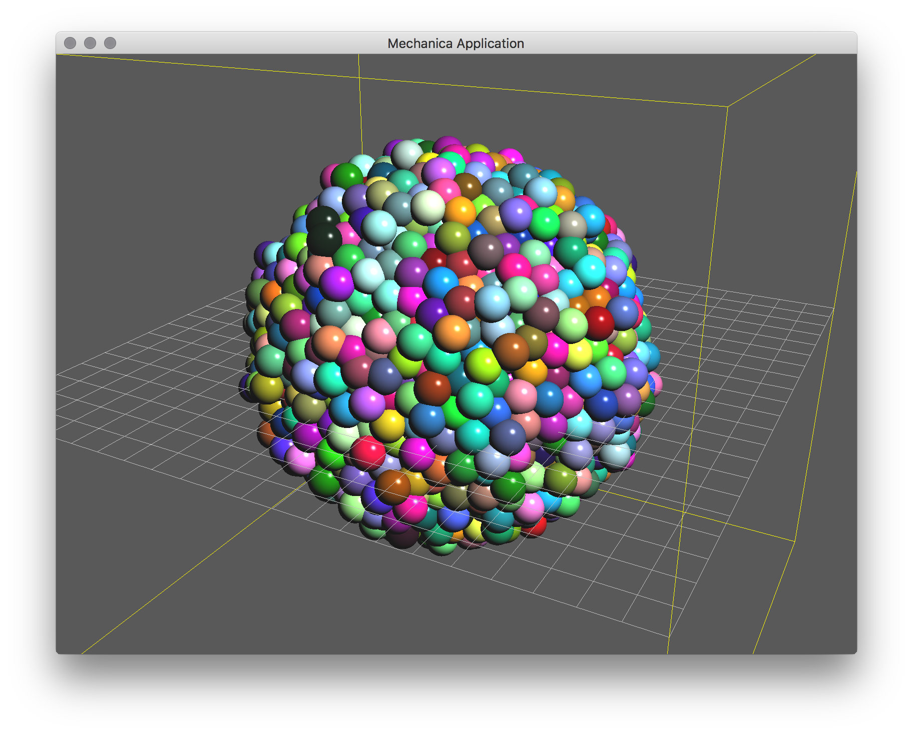
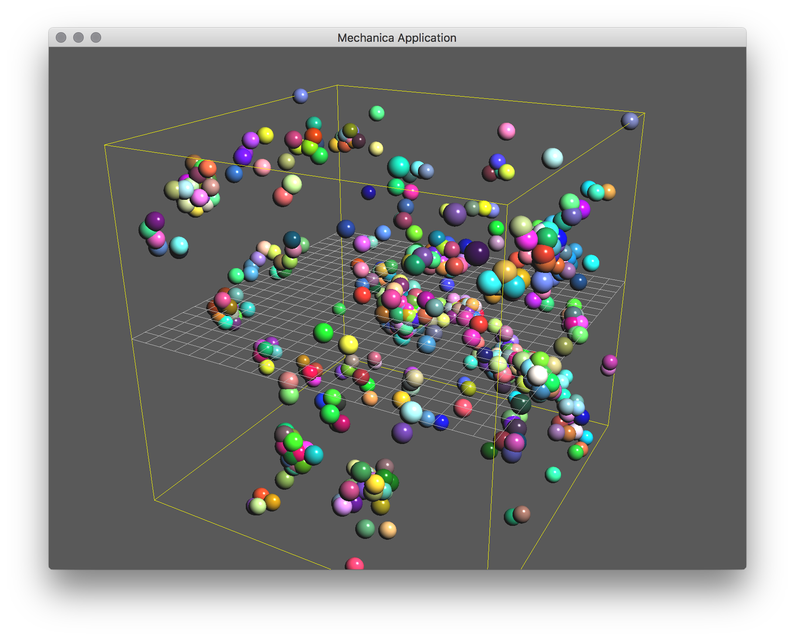

Mitosis and Events
------------------

In cell biology, *mitosis* is what the cell division process is called. This is
where a cell undergoes *fission* and splits into two. The mitosis process splits
the contents of the parent cell into two daughter cells. Usually the
two daughter cells are the same type, but sometimes differen, and the contents
usually get split semi-uniformly, but not always.

The mitosis process is part of the cell cycle, and usually gets triggered when
the parent cell reaches some specified growth stage. Mitosis is extremly
complicated when we look at every single detail, but in this example, we model
an extremly simplified mitosis, which is triggered at regular time
intervals. This is toy model simply to illustrate how to use time based events. 

    A basic mitosis simulation, about 15 lines of Python. 

We start with the normal imports, and setup the domain size, cutoff distance,
and make a simulator ::

  import mechanica as m
  import numpy as np
  
  # potential cutoff distance
  cutoff = 1
  
  # new simulator, don't load any example
  m.Simulator(example="", dim=[20., 20., 20.])

Make a soft sphere interaction potential. The `kappa` here is the strength of
the repussion (peak repussion energy), and the `epsilon` is the depth of the
attractive well, `r0` is the rest-length of this potential, i.e. if we set a r0
to 5, two particles will rest at center separation distance of 5. `min` and
`max` are the cutoff ranges, and `tol` is the tolerance, or how accuratly this
potential matches the exact potential, a value of around 0.1 is fine::
  
  
  pot = m.Potential.soft_sphere(kappa=400, epsilon=5,
    r0=0.7, eta=3, tol = 0.1, min=0.05, max=1.5)

Make a `Cell` class that extends particle, set the usuall class
properties. Here we add an `on_time` event, and bind it to the base
:class:`Particle.fission` method.

What happens here, is that for every *instance* of the Cell class, the
`on_time` event will get triggered at a period of 1 time unit, and call the
`fission` method on that object. Basically, we're addign an event handler to
every single instance of the object when we define an event in the class
definition::

  class Cell(m.Particle):
    mass = 20
    target_temperature = 0
    radius=0.5
    events = [m.on_time(m.Particle.fission, period=1, distribution='exponential')]
    dynamics=m.Overdamped

Here, we also added the Here, we also added the `dynamics=m.Overdamped` option
to the cell definition. This essentially makes the object move with overdamped
motion, in that the only time the object moves is when there are forces acting
on it. Overdamped is generally how all biological materials behave. 

Now we go ahead and proceed as usual, and simply bind the potential to the
`Cell` objects. Again, this will create a small attractive adhesion between the
objects, and and a spring like repulsion to enable the objects to push on each
other::

  m.Universe.bind(pot, Cell, Cell)

Make a `random` force. This essentailly gives each cell a certian motility, in
that it will move around small random motions. The first arg is the mean, and
the second is the strength of the random force. Bind the random force just like
any other force::
  
  rforce = m.forces.random(0, 0.5)

  m.Universe.bind(rforce, Cell)

Create a single cell instance at the center of our domain, and start the
simulation::

  Cell([10., 10., 10.])

  # run the simulator interactive
  m.Simulator.run()

The complete simulation script is here, and can be downloaded here:

Download the overdamped example:
:download:`mitosis.od.py <../../examples/mitosis.od.py>`

We also included a version that does not use overdamped dynamics. Run this one,
and see how the individaul objects move around and never really settle down. In
conventional dynamics, each object has an *inertia* and will continue to move
unless it is stopped by some other force. In overdamped dyanamics, object move
only where there is a force on them.

    A mitosis simulation usign conventional inertial dymamcis. 

You can download the complete dynamics example here:
:download:`mitosis.dyn.py <../../examples/mitosis.dyn.py>`

