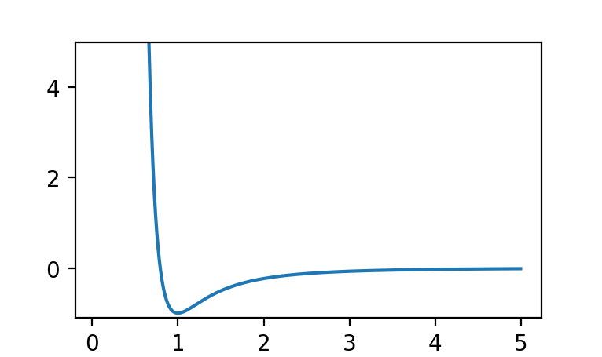
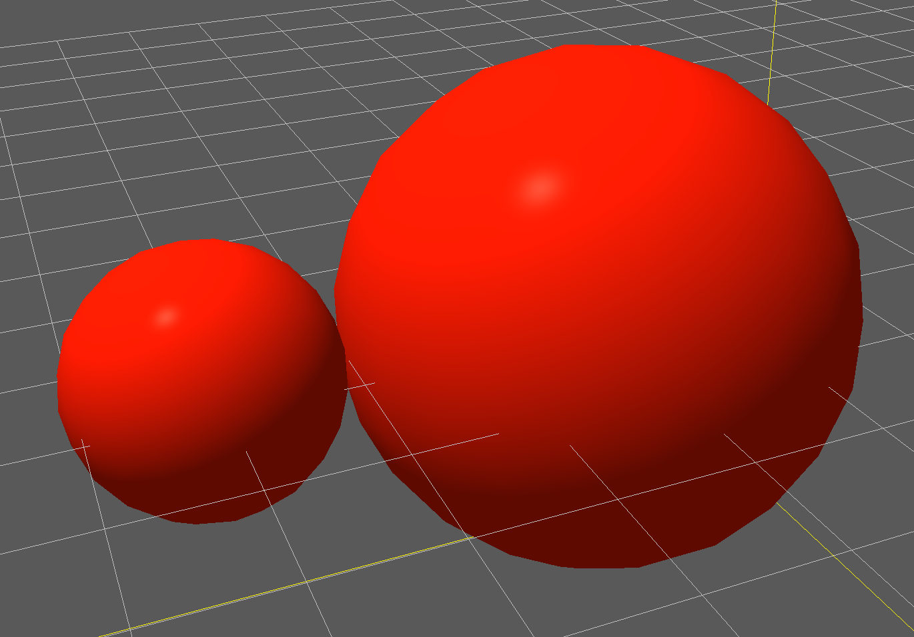
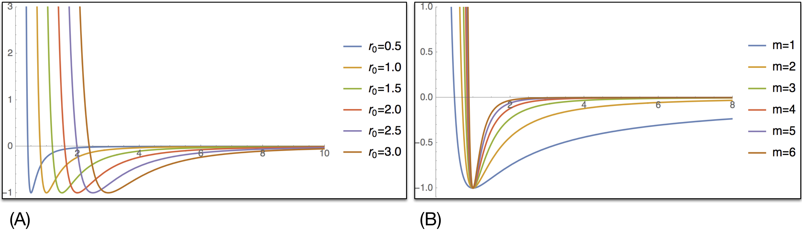
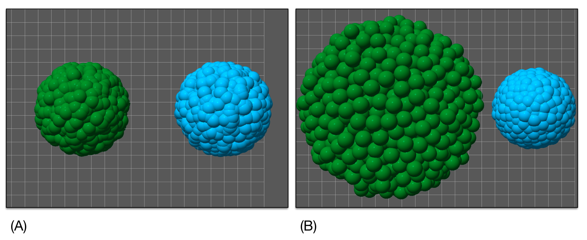

.. _potentials:

Potentials and Effect On Mechanics
==================================

One of the main goals of Mechanica is to enable users to rapidly develop and
explore emperical or phenomological models of active and biological matter in
the 100nm to multiple cm range. There are no pre-defined force fields in this
length scale, as such users need a good deal of flexibility to create and
calibrate potential functions to model material rheology and particle
interactions.

Mechanica provides a wide range of potentials in the :any:`Potential` class, we can
create any of these potential objects using the static methods in this class. 

Creating, Plotting and Exploring Potentials
-------------------------------------------

We create a potential object simply by calling one of the static methods on the
:any:`Potential` class. Potential objects conviently have a `plot` method on
them that displays a 'matplotlib' plot, for example::

  p = m.Potential.glj(10)
  p.plot()

results in 

.. rst-class:: sphx-glr-script-out

 Out:

 .. code-block:: none

    <Potential at 0x7fb7f6110210>

The `Generalized Lennard-Jones Potential`, :any:`Potential.glj` is one of the
most potential we offer, and supports a wide range of parameters. The `glj`
potential has the form

.. math::

            V^{GLJ}_{m,n}(r) = \frac{\epsilon}{n-m} \left[ m \left( \frac{r_0}{r}
            \right)^n - n \left( \frac{r_0}{r} \right) ^ m \right]

where :math:`r_e` is the effective radius, which is automatically
computed as the sum of the interacting particle radii.

In most traditional molecular dynamics packages, it is important to specify the
*r0* paramter in a potential, however, Mechanica automatically picks up the rest
length from the particle radius, For example, say we have two particles, one
with radius 1 and the other with 2, then, if these particles interact with a
potential like :any:`glj`, they will automatically have a rest separation
distance of 3. We can make a simple model like to illustrate this::

  class B(m.Particle):
    mass = 1
    dynamics = m.Overdamped

  # make a glj potential, this automatically reads the
  # particle radius to determine rest distance.
  pot = m.Potential.glj(e=1)

  m.bind(pot, B, B)

  p1 = B(center + (-2, 0, 0))
  p2 = B(center + (2, 0, 0))
  p1.radius = 1
  p2.radius = 2

  m.Simulator.run()

The two particles start out a with a little separation, but the potential pulls
them in such that they just touch at the specified radii, and we get an output
of:

This complete model is can be downloaded here:
:download:`glj-1.py <../../examples/glj-1.py>`

The Mechanica runtime automatically *shifts* the potential, such that the
minimum of the potential will always be when the separation distance between
particles is :math:`r_1 + r_2` where :math:`r_1` and :math:`r_2` are the radii
of the two interacting particles. 

The most important parameters to :any:`glj` are the *e*, *r0*, *m*, and *min*
parameters. The *e* represents the strength of the potential, it is the depth of
the potential well, and ultimatly determines how strongy objects stick
together. *r0* is the the lowest point of the potential, and *m* and *n* are the
exponents which determine how sharp or shallow the potential is.

*e* : potential energy
""""""""""""""""""""""

Appropriate values of *e* should be close to the mass of an object, if *e* is
much larger than about two to three times the mass at most, as this will result
in unrealistic behavior and numeric instability. *e* however can be small as
needed to create weakly bound or interacting objects.

*r0* : effective radius
"""""""""""""""""""""""
The *r0* parameter is the effective radius, and determines the equilibrium
distance of the potential. 

Mechanica however automatically shifts the potential relative to particle
radius, so *r0* doesn't determine separation distance as with a traditional
molecular dynamics package. Rather *r0* influences how soft the potential
is. Smaller values of *r0* lead to a stiff potential, with a harder shoulder,
i.e. it makes the particles harder. Whereas larger values of *r0* spread the
potential well out over a larger distnce, and also allows the potential to be
longer ranging, and attract objects from longer distances, as in (A) of
:numref:`glj_fig`. 

*m* : potential exponent
""""""""""""""""""""""""

The *m* and *n* parameter are the exponents of the potential, and these are
principally responisble for how soft or hard the potential is. Small values of
*m* results in a softer, potential, and also allow a longer ranging potential,
much like the *r0* parameter. It is normally not required to specify the *n*
parameter, as the potential constructor automatically sets this to :math:`2 *
m`, because this format is widely used in many meso-scale particle dynmics based
simulations, and results in well-behaved numerics and realistic physical
behavior.   

    (A) Varrying the :math:`r_0` parameter in a `glj` potential, while holding
    all other parameters constant, with *e=1*, *m=3*, *n=6*. (B) Varrying the
    *m* parameter in a `glj` potential, holding *e=1*, :math:`r_0=1` and with
    *m=2n*.  

*max* : potential cutoff distance
"""""""""""""""""""""""""""""""""

The potential cutoff distance, *max* has a very strong influence on material
properties and dynamics. Longer cutoff distances enable us to model things such
as an membrane pulling longer distance particles inwards, or long-range coulomb
or magnetic potentials, or possibly some more phenomological interactions such
as *boids*, however longer ranged potentials are typically not very realistic in
mesoscopic materials.

In mesocopic and biological materials, we typicaly have an interaction that has
a short range repulsion -- that keeps things from being pushed together, and
also a short-range attraction that allows object near each other to stick
together, and also lets us model things like fluids, where they like to stick to
each other. If we allow longer-range potentials, such as in
:numref:`glj_cutoff_fig`, we end up with a situation where the particles that
make up an object pull so hard on other paticles that it causes the object to
collapse down to a point. This is especially true when we use a softer potential
that does not provide as much short-range repulsion.

For example, we can construct the model that's shown in :numref:`glj_cutoff_fig`
by creating a :any:`Cluster` type, addign a few particle types to it, and
creating two different potentials to act on them as::

  class C(m.Cluster):
    radius=3

    class A(m.Particle):
        radius=0.5
        dynamics = m.Overdamped
        mass=10
        style={"color":"MediumSeaGreen"}

    class B(m.Particle):
        radius=0.5
        dynamics = m.Overdamped
        mass=10
        style={"color":"skyblue"}

  c1 = C(position=center - (3, 0, 0))
  c2 = C(position=center + (7, 0, 0))

  c1.A(2000)
  c2.B(2000)

  p1  = m.Potential.glj(e=7, m=1, max=1)
  p2  = m.Potential.glj(e=7, m=1, max=2)
  m.bind(p1, C.A, C.A, bound=True)
  m.bind(p2, C.B, C.B, bound=True)

  rforce = m.forces.random(0, 10)
  m.bind(rforce, C.A)
  m.bind(rforce, C.B)

Here we created two very soft :any:`glj` potentials, we made them soft because
we used *m=1* to set the exponent, as discussed earlier. We set one potential to
a cutoff of 1 (twice the particle radius) and the other to a cutoff of 2 (four
times the particle radius). The longer range potential pulls on many more
particles, and the net attraction of these overcomes the relativly soft short
range repulsion. The complete code to create :numref:`glj_cutoff_fig` can be
downloaded here:
:download:`glj-1.py <../../examples/glj_cluster1.py>`

To overcome the this issue of particle clumps collapsing, or overlappign
particles, we reccomend cutoff distances of around 2-3 times the smallest
particle radius. The *max* cutoff distance defaults to three times the effective
radius, *r0*, we found that this distance generally works well, so users
typically would not need to explicitly set this parameter. 

    Two clusters, both with identical particles, and identical initial
    conditions. The left cluster (green) has a shorter cutoff (twice particle radius), on the potential,
    ad the right one (blue) has a longer cutoff (four times particle
    radius). (A) Initializing two clusters of identical particles, both start
    out the same size. (B) After a few seconds of simulation time, the left 

