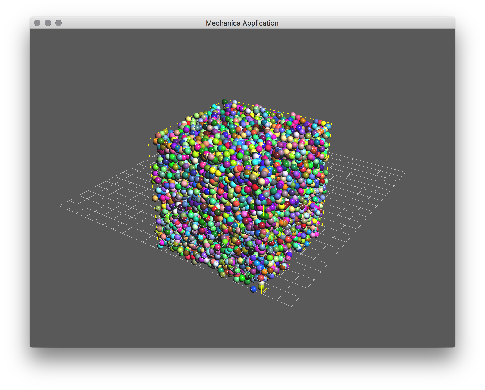

Quickstart
==========

Argon
-----

This example will create a complete simulation of a set of argon atoms.

First we simply import the packages, we will use Numpy to create initial conditions::

  import mechanica as m
  import numpy as np

Define some variables that define the potential cutoff distance and size of the
simulation domain. Potential cutoff is the maximum distance that for which the
runtime evaluates potentials, for performance reasons, it should be kept
reasonably small ::

  # potential cutoff distance
  cutoff = 1

  # dimensions of universe
  dim=[10., 10., 10.]

The first thing we have to do, before we create any simulation objects is
initialize the simulator. This essentially sets up the simulation environment,
and gives us a place to create our model. ::

  m.Simulator(dim=dim)

Particles interact via *Potentials*, :class:`Potential`. We supply a variety of
pre-built potentials, and users can create their own, but for now, the
Lennard-Jones 12-6 is one of the most commonly used potentials. All we have to
do is create an instance of one, and *bind* it to an an object type. To create a
LJ potential ::

  # create a potential representing a 12-6 Lennard-Jones potential
  # A The first parameter of the Lennard-Jones potential.
  # B The second parameter of the Lennard-Jones potential.
  # cutoff 
  pot = m.Potential.lennard_jones_12_6(0.275 , cutoff, 9.5075e-06 , 6.1545e-03 , 1.0e-3 ) 

It's most common to sub-class the base particle type. By subclassing it, users
can specify a variety of attributes that define that particular type, such as
mass.::

  # create a particle type
  # all new Particle derived types are automatically registered with the universe
  class Argon(m.Particle):
      mass = 39.4
    
Whenever a new Particle derived type is created, it is automatically registerd
with the Universe.

The total force on any phyiscal object such as a particle is simply the sum of
all potentials that act on that object. To make a potential act on a particular
kind of type, we *bind* the potential to the type of object we want it to act on::

  # bind the potential with the *TYPES* of the particles
  m.Universe.bind(pot, Argon, Argon)

For our simulation, we want to fill the simulation domain with a uniformly
random distrubted particles. The simplest way to do this is the use the numpy
random function to generate an array of uniform random distibuted positions::

  # uniform random cube
  positions = np.random.uniform(low=0, high=10, size=(10000, 3))

Then with the array of positions, we simply itterate over the postions, and
create a new particle; When we create a new particle derived object, it gets
automatically added to the universe, we don't need to do anything else with it::

  for pos in positions:
      # calling the particle constructor implicitly adds 
      # the particle to the universe
      Argon(pos)

Now all that's left is to run the simulation. The :class:`Simulator` object has
two methods on it, `run` and `irun`. The `run` method runs the simulator, and
continues until the window is closed, or some stop condition. The `irun` method
starts the simulation, but leaves the console open for further input. The `irun`
method is only used when running from `iPython`.::
    
  # run the simulator interactive
  m.Simulator.run()

The complete simulation script is here, and can be downloaded here:

Download: :download:`this example script <../../examples/argon.py>`::

  import mechanica as m
  import numpy as np

  # potential cutoff distance
  cutoff = 1

  # dimensions of universe
  dim=[10., 10., 10.]

  m.Simulator(dim=dim)

  # create a potential representing a 12-6 Lennard-Jones potential
  # A The first parameter of the Lennard-Jones potential.
  # B The second parameter of the Lennard-Jones potential.
  # cutoff
  pot = m.Potential.lennard_jones_12_6(0.275 , cutoff, 9.5075e-06 , 6.1545e-03 , 1.0e-3 )
  
  # create a particle type
  # all new Particle derived types are automatically
  # registered with the universe
  class Argon(m.Particle):
      mass = 39.4
  
  # bind the potential with the *TYPES* of the particles
  m.Universe.bind(pot, Argon, Argon)

  # uniform random cube
  positions = np.random.uniform(low=0, high=10, size=(10000, 3))

  for pos in positions:
      # calling the particle constructor implicitly adds
      # the particle to the universe
      Argon(pos)

  # run the simulator interactive
  m.Simulator.run()

    A basic argon simulation

