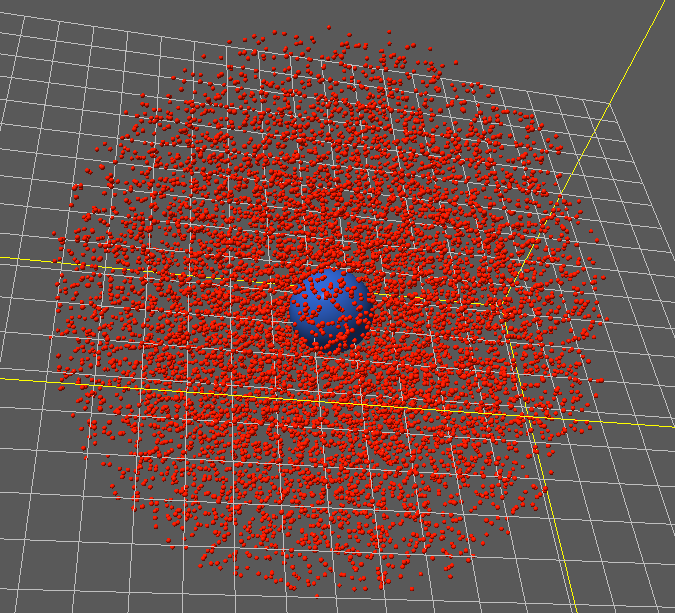

Cytoplasmic Particles
---------------------

The motion of particles inside a cell is a very interesting scientific
problem. We have a number of ways of representing particles bound to a region,
we introduce the simplest method here. Mechanica provides a :any:`well`
potential that creates a hard potential wall, and constrains particles inside
it. We can use the square well potential to model receptors in a cell's
cytoplasm.

Start with the usual model setup::

  import mechanica as m
  import numpy as np

  # potential cutoff distance
  cutoff = 9

  receptor_count = 10000

  # dimensions of universe
  dim=np.array([20., 20., 20.])
  center = dim / 2

  # new simulator, don't load any example
  m.Simulator(dim=dim, cutoff=cutoff, cells=[4, 4, 4], threads=8)

Make a couple particle types, one to represent a nucleus, and another for
receptors. We want the nucleus fixed in space, so make it very heavy::

  class Nucleus(m.Particle):
     mass = 500000
     radius = 1

  class Receptor(m.Particle):
     mass = 0.2
     radius = 0.05
     target_temperature=1
     #dynamics = m.Overdamped

Create a array of random positions within a solid sphere for the initial receptor
positions::

  # locations of initial receptor positions
  receptor_pts = m.random_point(m.SolidSphere, receptor_count) * 5  + center

Make a :any:`well` potential, and a :any:`soft_sphere` potential. The well
confines the receptors to within a fixed distance of the nucleus, and the soft
sphere potential gives the receptors a definite shape, and prevents overlapping::

  pot_nr = m.Potential.well(k=15, n=3, r0=7)
  pot_rr = m.Potential.soft_sphere(kappa=15, epsilon=0, r0=0.3, eta=2, tol=0.05, min=0.01, max=1)

  # bind the potential with the *TYPES* of the particles
  m.bind(pot_rr, Receptor, Receptor)
  m.bind(pot_nr, Nucleus, Receptor)

Create a random force (Brownian motion), zero mean of given amplitude, this
gives the receptors some random motion. ::

  tstat = m.forces.random(0, 3)

  # bind it just like any other force
  m.bind(tstat, Receptor)

Position the nucleus at the middle, and loop over the receptor points, and make
a receptor, and finally run the simulation::

  n=Nucleus(position=center, velocity=[0., 0., 0.])

  for p in receptor_pts:
     Receptor(p)

  # run the simulator interactive
  m.Simulator.run()

    The square well binds particles to a region of space

The complete simulation script is here, and can be downloaded here:

Download: :download:`this example script <../../examples/square_well.py>`
