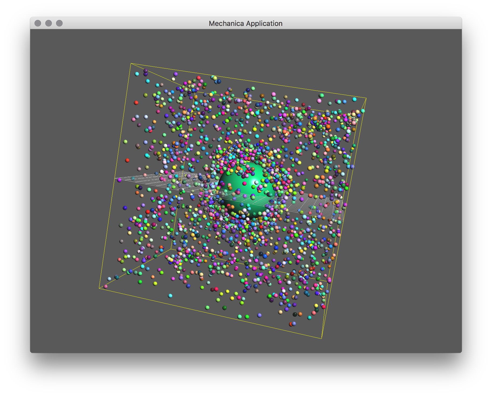

Two Types
---------

We can make a model with more than one type simply by making different
:class:`Particle` derived classes::

  import mechanica as m
  import numpy as np

  # potential cutoff distance
  cutoff = 8

  count = 1000

  # dimensions of universe
  dim=np.array([20., 20., 20.])
  center = dim / 2

  # new simulator, don't load any example
  m.Simulator(dim=dim, cutoff=cutoff)

Make a *Big* and *Small* types::

  class Big(m.Particle):
    mass = 500000
    radius = 3

  class Small(m.Particle):
    mass = 0.1
    radius = 0.2
    target_temperature=0

Make a pair on interaction potentials, one between the Small particle types, and
one betwen the Big and Small particles. Here, we choose the `r0` paramter
according to the particle types radius. TODO: next version will automatically
pick up the radisu from the type definitions. We bind these two potentials
between the different particle types.::

  pot_bs = m.Potential.soft_sphere(kappa=10000, epsilon=100, r0=3.2, \
    eta=3, tol = 0.1, min=0.1, max=8)

  pot_ss = m.Potential.soft_sphere(kappa=50, epsilon=10, r0=0.2, \
    eta=2, tol = 0.05, min=0.01, max=4)

  # bind the potential with the *TYPES* of the particles
  m.bind(pot_bs, Big, Small)
  m.bind(pot_ss, Small, Small)

Make a single Big particle in the middle of our domain::

  Big(position=center, velocity=[0., 0., 0.])

Make a disk of small particles above the big particle. We use the built-in
:function::`random_point` function to fill regions of space with randomly
distributed points::

  for p in m.random_point(m.Disk, count) * \
    1.5 * Big.radius + center + [0, 0, Big.radius + 1]:
    Small(p)

And finally run the simulation::

  # run the simulator interactive
  m.Simulator.run()

    A basic two-type simulation, about 15 lines of Python. We are using
    Newtonian instead of overdamped dynamics, so each object has a good deal of
    inertia. We notice that single there is an attractive potential between the
    big and small objcts, most of the small objects are clusterd aournd the
    single big particle in the middle. Also notice that the small particles tend
    to produce clusters, as they too are attractive to each other. 

The complete simulation script is here, and can be downloaded here:

Download: :download:`this example script <../../examples/two-type.py>`::
