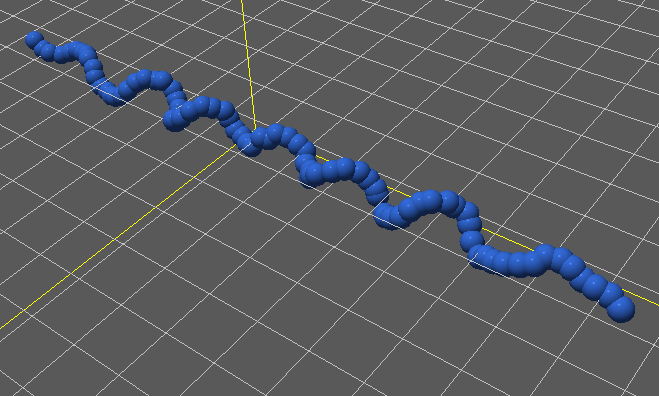

Worm Like Chain
---------------

Cyanobacteria often form worm-like filaments and may grow in large masses or
"tufts" one meter or more in length. Some are unicellular, a few form branched
filaments, and a few form irregular plates or irregular colonies. Cyanobacterial
cells usually divide by binary fission, and the resulting cells may separate to
form new colonies. Some of the filamentous cyanobacteria are motile by means
gliding or rotating around a longitudinal axis,

.. list-table::

   * - .. figure:: cyanobacteria-1.jpg
          :width: 300px     

     - .. figure:: cyanobacteria-2.jpg
          :width: 300px

This model starts a worm-like chain and introduces the Mechanica Bond and Angle
:any:`bonded-interactions` to create a very simply bacterial filament
model. This model does not include self-propelled particles, we will introduce
these later.

In many bacterial filaments, each bacterial cell sticks to at most one or two
neighbors. We can not use a non-bonded type potential for this, as a non-bonded
interaction would stick to all bacteria with a range. Instead, we use a
:any:`Bond` to explicitly bond pairs of bacterial cells. Bacterial filaments
tend to have a certain stiffness, we use a :any:`Angle` to model this resistance
to bending. 

We can create a filament starting with the standard simulation setup::

  # potential cutoff distance
  cutoff = 8

  # dimensions of universe
  dim=np.array([20., 20., 20.])
  center = dim / 2

  # new simulator, don't load any example
  m.Simulator(example="", dim=dim, cutoff=cutoff)

We approximate a bacteria with a simple spherical `Bead`. For the time being, we
ignore the fact that bacteria in fact tend to be lozenge shaped. We'll cover
non-spherical particles later::

  class Bead(m.Particle):
    mass = 0.4
    radius = 0.2
    dynamics = m.Overdamped

Use over-damped dynamics to model Brownian motion. To represent steric occlusion,
add a soft-sphere interaction potential to the bacterial particles. This form of
the potential creates a slightly compressible bacteria, and with a non-zero
`epsilon` term, is slightly attractive to other bacteria:: 

  pot_bb = m.Potential.soft_sphere(kappa=20, epsilon=5.0, \
                                 r0=0.2, eta=4, tol=0.01, min=0.01, max=0.5)

Use a :any:`harmonic` potential to model the attachment of neighboring cells::

  # harmonic bond between particles
  pot_bond = m.Potential.harmonic(k=40., r0=0.2, max = 2)

And a :any:`harmonic_angle` potential to represent this stiffness of the filament::

  # angle bond potential
  pot_ang = m.Potential.harmonic_angle(k=20, theta0 = 0.85*np.pi, tol=0.1)

Attach the non-bonded potential to the `Bead` type, this will cause all
instances of the bead to be able to push on each other, and give them a definite
shape::

  # bind the potential with the *TYPES* of the particles
  m.bind(pot_bb, Bead, Bead)

Make a random force to apply to the beads, In over-damped dynamics, we need a
random force to enable the objects to move around, otherwise they tend to get
trapped in a potential::

  rforce = m.forces.random(0, 1)

Bind it just like any other force::

  m.bind(rforce, Bead)

We want to start our filament basically oriented in a line, so make a numpy
array of contiguous positions for the `x` axis, and hole the `y` and `z`
fixed. We will iterate over this array of positions, and create a new Bead
particle for each one. Recall that a Bond connects adjacent pairs of bacteria,
but a Angle is a 3-body term, so we need to attach it to each bacterial cell,
but we need to keep track of the previous and next cells::

  # make a array of positions
  xx = np.arange(4., 16, 0.15)

  p = None                              # previous bead
  bead = Bead([xx[0], 10., 10.0])       # current bead

  for i in range(1, xx.size):
     n = Bead([xx[i], 10.0, 10.0])     # create a new bead particle
     m.Bond(pot_bond, bead, n)             # create a bond between prev and current
     if(i > 1):
        m.Angle(pot_ang, p, bead, n) # make an angle bond between prev, cur, next
     p = bead
     bead = n

And finally run the simulator::
  
  m.Simulator.run()

The simulation output shows filament, you can play around with the initial
positions, natural angle, bond and sphere stiffness. 

   

The complete simulation script is here, and can be downloaded here:

Download: :download:`this example script <../../examples/bonded_beads.py>`::
